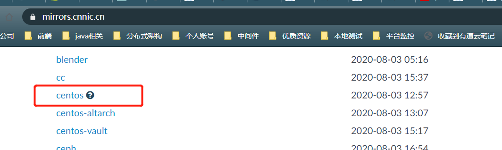
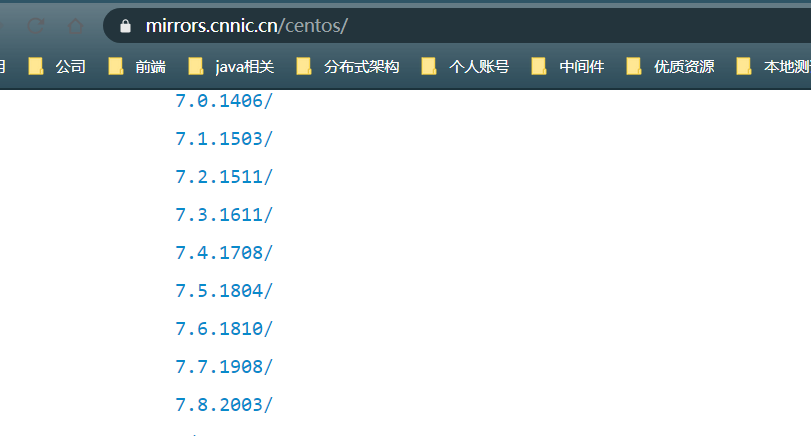
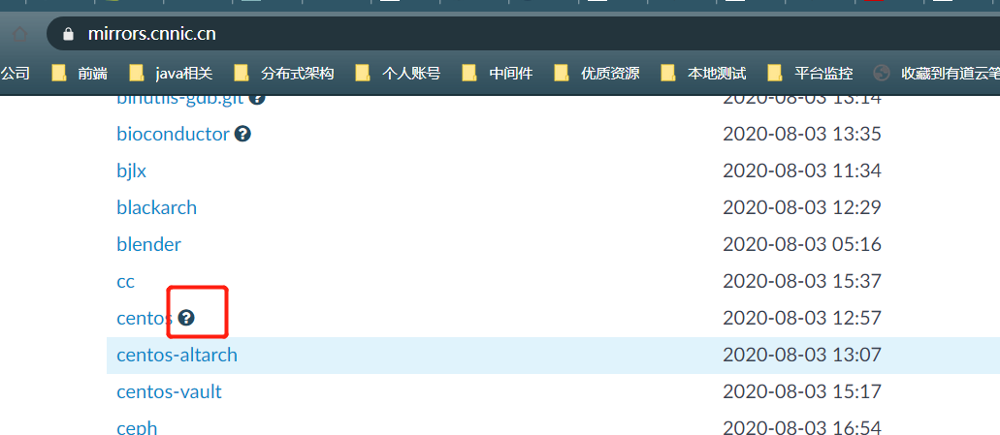
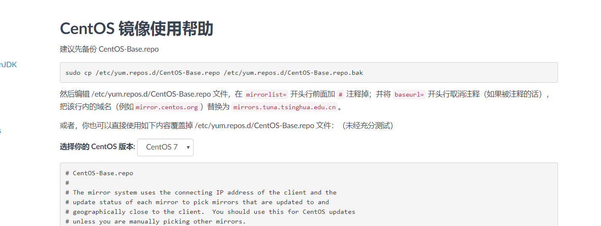

## 配置国内yum源

### 问题

在部署docker时，遇到官方源链接不上的问题

```
# yum list docker-ce --showduplicates | sort -r
...
Could not retrieve mirrorlist http://mirrorlist.centos.org/?release=7&arch=x86_64&repo=os&infra=stock error was
14: curl#7 - "Failed to connect to 2001:4178:5:200::10: Network is unreachable"
...
```

### 解决

切换国内镜像源。

使用yum install软件，yum获取源仓库中寻找对应的软件，并处理各种依赖问题。当时经常因为网络原因，官方的源连接不上，就会出现这个问题。

#### 现在切换成国内清华的源。

地址： https://mirrors.cnnic.cn/



点进去发现版本很多，查看自己的centos版本

```
# rpm -q centos-release
centos-release-7-8.2003.0.el7.centos.x86_64
```






点后面的小问号。



按照使用帮助操作即可。

##### 1，先备份

```
sudo cp /etc/yum.repos.d/CentOS-Base.repo /etc/yum.repos.d/CentOS-Base.repo.bak
```

##### 2,修改CentOS-Base.repo

编辑 /etc/yum.repos.d/CentOS-Base.repo 文件，

在 `mirrorlist=` 开头行前面加 `#` 注释掉；

并将 `baseurl=` 开头行取消注释（如果被注释的话），把该行内的域名（例如`mirror.centos.org`）替换为 `mirrors.tuna.tsinghua.edu.cn`。


注意是https

##### 3，更新软件包缓存

```
yum clean all     # 清除系统所有的yum缓存
yum makecache     # 生成yum缓存
```

