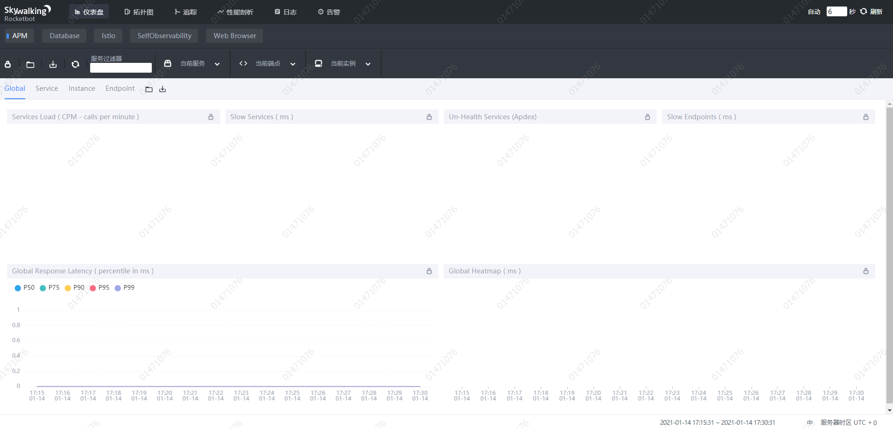

## 部署Skywalking

### 部署elasticsearch

Skywalking官方建议存储使用es，所以先部署es。

注意，在目前官方说明中，skywalking分别有es6和es7两个版本

我们这里安装es6版本。

```sh
docker pull docker.elastic.co/elasticsearch/elasticsearch:6.8.13
```


测试环境下，先启动单节点实例

```sh
docker run --name elasticsearch -p 9200:9200 -p 9300:9300  -e "discovery.type=single-node" -e ES_JAVA_OPTS="-Xms512m -Xmx512m" -d docker.elastic.co/elasticsearch/elasticsearch:6.8.13
```

-e "discovery.type=single-node" 设置为单节点
特别注意：
-e ES_JAVA_OPTS="-Xms512m -Xmx512m"  测试环境下，设置ES的初始内存和最大内存，否则导致过大启动不了ES


### 部署skywalking

#### 拉取镜像

```
docker pull apache/skywalking-base:8.3.0-es6

docker pull apache/skywalking-oap-server:8.3.0-es6

docker pull apache/skywalking-ui:8.3.0
```

#### 启动 SkyWalking Server :

```
docker run --name skywalking-oap --restart always -p 1234:1234 -p 11800:11800 -p 12800:12800 -d --link elasticsearch:elasticsearch -e SW_STORAGE=elasticsearch -e SW_STORAGE_ES_CLUSTER_NODES=elasticsearch:9200 apache/skywalking-oap-server:8.3.0-es6
```

默认端口就是12800


#### 启动 UI ：

```
docker run --name skywalking-ui --restart always -p 9898:8080 --link skywalking-oap:skywalking-oap -d -e SW_OAP_ADDRESS=skywalking-oap:12800 apache/skywalking-ui
```

访问9898端口



安装成功

### 使用

以java使用为例。

#### 1，拿到agent包

去官网下载skywalking的完整tar包

解压，把里面的agent文件夹整个传到被监控应用所在的服务器上

#### 2，配置被监控应用的启动参数

```
-javaagent:/path/to/skywalking-agent/skywalking-agent.jar -Dskywalking.agent.service_name=my-App-name -Dskywalking.collector.backend_service=localhost:11800
```

