# GIT操作指南

[TOC]

| 作者 | 技术笔记与开源分享 |
| ---- | ------------ |
| 版本 | 1.0    |
| 更新时间 | 2020-3-15 |


## Git与SVN的主要区别

### Svn是集中式的版本控制系统，而git是分布式的

集中式就存在单点故障风险，一旦SVN的远程仓库挂掉了，那我的本地项目再也不能做提交，也不能做分支的切换，也不能够干和版本管理相关的任何事情。更极端一点，如果svn的服务器磁盘故障，虽然我们可能利用某些员工本地的快照版本尽可能恢复工程，但是当我们把这个相对完整的版本重新部署到服务器的新仓库时，将会丢失所有的历史版本包括日志。

git是分布式的，表示我们每个人的本地项目都包含一个完整Git仓库。这一点一定要牢记，**本地也是一个仓库**。

.svn只是简单的保存一些版本信息，但是如果你把.git目录的体积大小跟.svn比较，你会发现它们差距很大。因为.git目录是处于你的机器上的一个克隆版的版本库，并不只提取最新版本的文件快照， 而是把代码仓库完整地镜像下来，包括完整的历史记录。

### 基本工作原理的不同

这部分最关键，请耐心看完。理解git的思想，而不是单纯的会使用几个命令。知其然，更要知其所以然。

SVN是记录每个文件每个版本的差异变化，可以说是**基于文件差异的版本控制**


如图，svn是存储每个文件在版本的不断迭代中产生的**差异**。


git不一样。如下图所示，git在你每次提交时，都会对所有文件产出一个快照。当然，如果文件没有修改，本次的快照只是生成一个链接，指向之前的文件，不会再copy一份文件。这和docker的分层镜像有点相似。


对比两张图，git倾向于纵向切分，每一个版本是一个清晰独立的版本。而svn的每一个版本，需要在前一个版本的基础上追加差异才能得到。


### 代码提交方式

svn相对来说更容易上手，更新代码-->开发代码-->提交代码commit

git相对来说要复杂一点，更新代码-->开发代码-->add -->commit -->push

为什么步骤这么多，因为**本地也是一个仓库**。


### 本地操作

因为git在本地是一个完整的仓库。所以绝大部分git命令都不需要访问远程仓库。

例如要浏览项目的历史，Git 不需外连到服务器去获取历史，只需直接从本地数据库中读取。


## Git理论基础

首先明确git中的术语

### 仓库

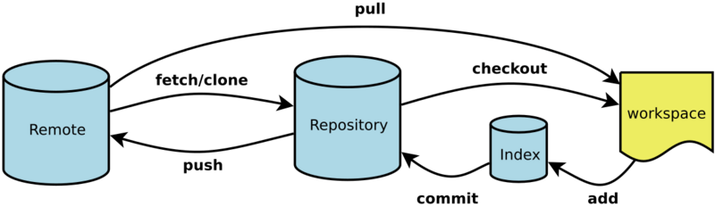

workspace：工作区。当前你修改的代码所在的地方。

index：暂存区。执行 git add命令后变动会提交到这。进入暂存区的变动才开始被git管理。

repository：本地仓库。git commit命令

remote：远端仓库/中央仓库。git push命令。

下面这张图更详细一点：

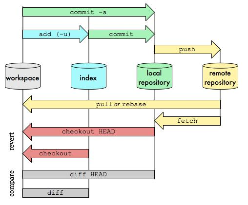

### 分支

有人把 Git 的分支模型称为它的“必杀技特性”，也正因为这一特性，使得 Git 从众多版本控制系统中脱颖而出。 为何 Git 的分支模型如此出众呢？ Git 处理分支的方式可谓是难以置信的轻量，创建新分支这一操作几乎能在瞬间完成，并且在不同分支之间的切换操作也是一样便捷。理解和精通这一特性，你便会意识到 Git 是如此的强大而又独特

前面我们讲过，**Git 保存的不是文件的变化或者差异，而是一系列不同时刻的 快照 。**

Git 是怎么创建新分支的呢？ 很简单，它只是为你创建了一个可以移动的新的指针。


如图，最早的提交时98ca9，每次提交后，整个master分支不断变长。HEAD是一个特殊指针，告诉git，我们现在在哪个分支上。

> 备注：Git 的 `master` 分支并不是一个特殊分支。 它就跟其它分支完全没有区别。 之所以几乎每一个仓库都有 master 分支，是因为 `git init` 命令默认创建它，并且大多数人都懒得去改动它。

然后，我们在f30ab这个提交上，使用`git branch`命令创建一个testing分支。（`git branch`命令只是创建分支，并不会切换分支）

使用`git checkout testing`进行分支切换


现在head指针就指向了testing分支，我们所作的改动全部发生在testing分支上。


做一次新的改动提交。testing分支继续变长。但是master分支依然指向f30ab。

如果现在我们想回到master分支继续开发，只需要`git checkout master`切回master分支。

> 注意，这时你的工作目录恢复成 `master` 分支所指向的快照内容。 也就是说，你现在做修改的话，项目将始于一个较旧的版本。 本质上来讲，这就是忽略 `testing` 分支所做的修改，以便于向另一个方向进行开发。


这与过去大多数版本控制系统形成了鲜明的对比，它们在创建分支时，将所有的项目文件都复制一遍，并保存到一个特定的目录。。所需时间的长短，完全取决于项目的规模。 而在 Git 中，任何规模的项目都能在瞬间创建新分支。 同时，由于每次提交都会记录父对象，所以寻找恰当的合并基础（即共同祖先）也是同样的简单和高效。

>创建新分支的同时切换过去
>
>通常我们会在创建一个新分支后立即切换过去，这可以用 `git checkout -b ` 一条命令搞定。

## Git基本操作

### 常用命令

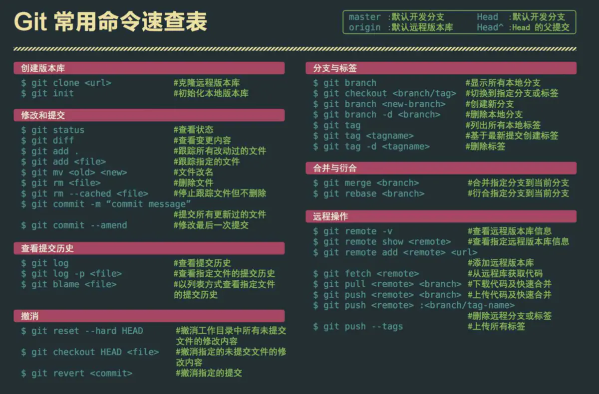

### 分支操作

#### 常用命令

| **git branch**                                   | **列出所有本地分支**                           |
| ------------------------------------------------ | ---------------------------------------------- |
| **git branch -r**                                | **列出所有远程分支**                           |
| **git branch -a**                                | **列出所有本地分支和远程分支**                 |
| **git branch [branch-name]**                     | **新建一个分支，但依然停留在当前分支**         |
| **git checkout -b [branch-name]**                | **新建一个分支，并切换到该分支**               |
| **git branch --track [branch]  [remote-branch]** | **新建一个分支，与指定的远程分支建立追踪关系** |
| **git checkout [branch-name]**                   | **切换到指定分支，并更新工作区**               |
| **git branch -d [branch-name]**                  | **删除分支**                                   |
| **git push origin --delete [branch-name]**       | **删除远程分支**                               |

#### merge操作

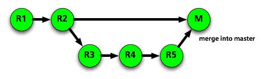

merge命令把不同的分支合并起来。如上图，在实际开放中，我们可能从master分支中切出一个分支，然后进行开发完成需求，中间经过R3,R4,R5的commit记录，最后开发完成需要合入master中，这便用到了merge。

| **git fetch [remote]** | **merge之前先拉一下远程仓库最新代码** |
| ---------------------- | ------------------------------------- |
| **git merge [branch]** | **合并指定分支到当前分支**            |

一般在merge之后，会出现conflict，需要针对冲突情况，手动解除冲突。主要是因为两个用户修改了同一文件的同一块区域。如下图所示，需要手动解除。

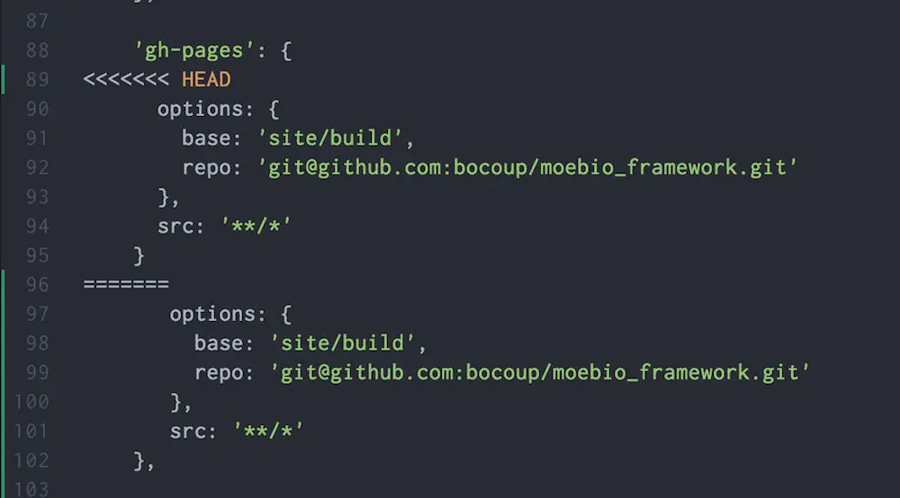

#### rebase操作

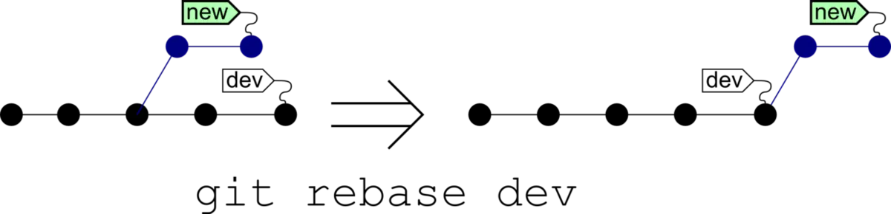

rebase又称为衍合，是合并的另外一种选择。

在开始阶段，我们处于new分支上，执行`git rebase dev`，那么new分支上新的commit都在master分支上重演一遍，最后checkout切换回到new分支。这一点与merge是一样的，合并前后所处的分支并没有改变。head依然指向new分支

`git rebase dev`，通俗的解释就是new分支想站在dev的肩膀上继续下去。rebase也需要手动解决冲突。

#### rebase与merge的区别

现在我们有这样的两个分支,test和master，提交如下：

```bash
      D---E test
     /
A---B---C---F master
```

在master执行`git merge test`,然后会得到如下结果：

```bash
      D--------E
     /          \
A---B---C---F----G   test, master
```

在master执行`git rebase test`，然后得到如下结果：

```bash
A---B---D---E---C'---F'   test, master
```

可以看到，merge操作**会生成一个新的节点**，之前的提交分开显示。而rebase操作**不会生成新的节点**，是将两个分支融合成一个线性的提交。

如果你想要一个干净的，没有merge commit的线性历史树，那么你应该选择git rebase
如果你想保留完整的历史记录，并且想要避免重写commit history的风险，你应该选择使用git merge

#### reset

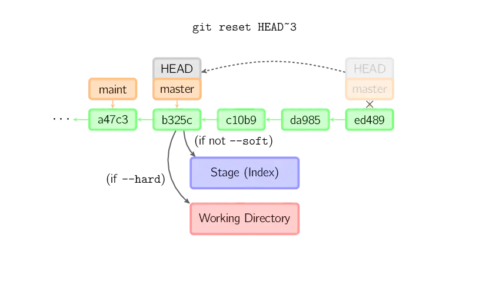

reset命令把当前分支指向另一个位置，并且相应的变动工作区和暂存区。这个命令还是比较危险的。操作时请确保你知道你要做什么。

| **git reset —soft [commit]**  | 只改变提交点，暂存区和工作目录的内容都不改变               |
| ----------------------------- | ---------------------------------------------------------- |
| **git reset —mixed [commit]** | **改变提交点，同时改变暂存区的内容**                       |
| **git reset —hard [commit]**  | **暂存区、工作区的内容都会被修改到与提交点完全一致的状态** |
| **git reset --hard HEAD**     | **让工作区回到上次提交时的状态**，本地的修改都不要了。     |

#### revert

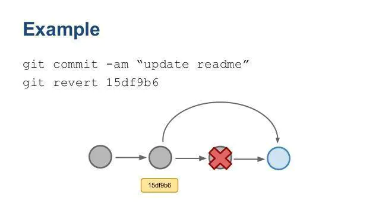

git revert用一个新提交来消除一个历史提交所做的任何修改。如上图，将提交回滚到15df9b6。

#### revert与reset的区别

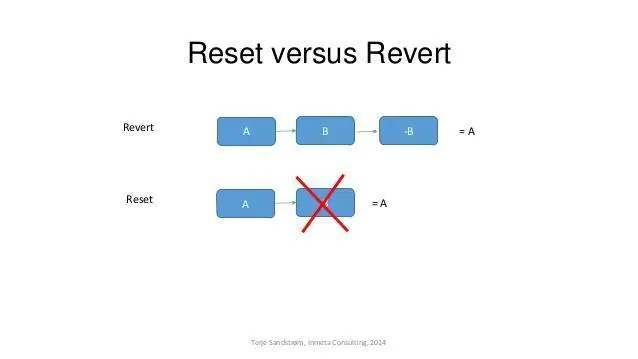

- git revert是用一次新的commit来回滚之前的commit，**git reset是直接删除指定的commit。**

- 在回滚这一操作上看，效果差不多。但是在日后继续merge以前的老版本时有区别。因为git revert是用一次逆向的commit“中和”之前的提交，因此日后合并老的branch时，导致这部分改变不会再次出现，减少冲突。但是git reset是之间把某些commit在某个branch上删除，因而和老的branch再次merge时，这些被回滚的commit应该还会被引入，产生很多冲突。

- git reset 是把HEAD向后移动了一下，而git revert是HEAD继续前进，只是新的commit的内容和要revert的内容正好相反，能够抵消要被revert的内容。

#### 分支策略

  master主分支应该非常稳定，用来发布新版本，一般情况下不允许在上面工作，工作一般情况下在新建的dev分支上工作，工作完后，比如上要发布，或者说dev分支代码稳定后可以合并到主分支master上来。

### push

上传本地仓库分支到远程仓库分支，实现同步。

| git push [remote]  [branch]     | 上传本地指定分支到远程仓库                 |
| ----------------------------- | ------------------------------------------ |
| **git push [remote] --force** | **强行推送当前分支到远程仓库，即使有冲突**。**不建议使用** |
| **git push [remote] --all**   | **推送所有分支到远程仓库**                 |


### 打标签操作

Git 支持两种标签：轻量标签（lightweight）与附注标签（annotated）。

```css
git tag v1.0   //轻量标签
```

```bash
git tag -a tagName -m "my tag"   //附注标签。建议使用
```

#### 后期打标签

假如你忘记了对某个提交打标签，可以后期补上

```console
 git tag -a v1.2 9fceb02  -m "补打标签"
```


#### 将tag同步到远端仓库

默认情况下，`git push` 命令并不会传送标签到远程仓库服务器上。 在创建完标签后你必须显式地推送标签
 使用`git push origin [tagName]`推送单个分支。

```css
git push origin v1.0
```

推送本地所有tag，使用`git push origin --tags`。

#### 切换到某个tag

跟分支一样，可以直接切换到某个tag去。

```console
git checkout v1.0
```

但是注意：**这个时候不位于任何分支，处于游离状态**，可以考虑基于这个tag创建一个分支。

```console
git checkout -b 新分支名 v1.0
```


### 其他命令

| git status                   | 显示有变更的文件                             |
| ---------------------------- | -------------------------------------------- |
| **git log**                  | **显示当前分支的版本历史**                   |
| **git diff**                 | **显示暂存区和工作区的差异**                 |
| **git diff HEAD**            | **显示工作区与当前分支最新commit之间的差异** |
| **git cherry-pick [commit]** | **选择一个commit，合并进当前分支**           |


## Git问题解决

### 员工密码定期修改后的问题

我们的git仓库bitbucket密码是和员工账号密码绑定的。我们的员工密码每两个月会强制修改一次，导致git密码校验失败。

错误显示：remote error: CAPTCHA required

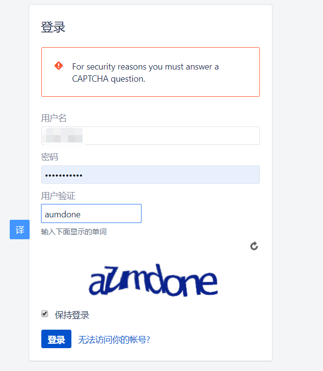

#### 解决：

**1，打开控制面板；**

**2.点击打开用户账户；**


**3.点击打开凭证管理（windows凭证管理栏）**


**4.普通凭证下拉打开修改你已存在的git账号密码**


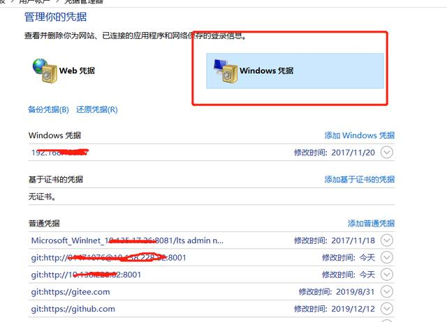

修改或删除都可以

5. **回到浏览器上把账户退出，重新登录下**

   这一步经常会漏。


### 放弃本地修改

本地代码被改乱了。想要放弃重来。分三种情况。

#### 1. 未使用git add 缓存代码

- 放弃某个文件的修改

  注意中间有--

```undefined
git checkout -- filename
```

- 放弃所有文件修改 git checkout .

```undefined
git checkout .
```

- 此命令用来放弃掉所有还没有加入到缓存区（就是 git add 命令）的修改：**内容修改与整个文件删除**
- 注意：**此命令不会删除新建的文件，因为新建的文件还没加入git管理系统中，所以对git来说是未知，只需手动删除即可**

#### 2. 已使用git add 缓存代码，未使用git commit

- 使用 git reset HEAD filename

```undefined
git reset HEAD filename
```

- 放弃所有文件修改 git reset HEAD

```undefined
git reset HEAD
```

此命令用来清除 git  对于文件修改的缓存。相当于撤销 git add 命令所做的工作。**在使用本命令后，本地的修改并不会消失，而是回到了第一步1. 未使用git add 缓存代码，继续使用用git checkout -- filename，就可以放弃本地修改**

#### 3. 已经用 git commit  提交了代码

- 使用 git reset --hard HEAD^ 来回退到上一次commit的状态

```undefined
git reset --hard HEAD^
```

- 或者回退到任意版本git reset --hard  commit id ，使用git log命令查看git提交历史和commit id

```objectivec
git reset --hard commit id
```