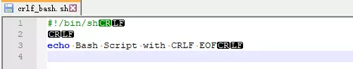
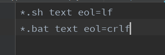

## git解决换行符灾难

由于历史原因，不同的操作系统，在处理换行符时，使用了不同的方案。Windows 操作系统使用了 `CRLF`，而 Unix 阵营的操作系统则使用了 `LF`。Mac OS 最起初使用了 `CR`，后来到了 Mac OS X 后，改成了使用 `LF`，与 Unix 阵营保持了一致。虽然目前很多代码编辑器都支持自动识别和切换换行符风格，然而，总有那么一些不合群的编辑器，无法达到相应的兼容性。

我们的项目里有一些sh脚本，如果使用 `CRLF` 风格的换行符，bash 解释器可能无法正常工作；

如图所示。

而且有一些同事的编辑器，一旦你打开文件。会自动帮助你默默的把换行符改成当前操作系统的风格。

这就在不知不觉中导致打的包部署失败。

#### 解决

git提供了.gitattributes文件，可以配置禁止sh文件转换换行符，始终保持LF换行。

对于sh文件，标记为文本文件，在文件入Git库时进行规范化，即行尾为LF。在检出到工作目录时，行尾也不会转换为CRLF（即保持LF）。

使用 `*.bat text eol=crlf` 就可以保证 Windows 的批处理文件在 `checkout` 至工作区时，始终被转换为 `CRLF` 风格的换行符；

gitattributes还有其他的配置，搜索即可。

