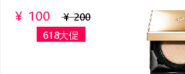

## Graphics2D 文字抗锯齿


添加抗锯齿代码

```
// 抗锯齿
graphics.setRenderingHint(RenderingHints.KEY_TEXT_ANTIALIASING, RenderingHints.VALUE_TEXT_ANTIALIAS_LCD_HRGB);
```

效果如下


效果还是有一些的。就是有点模糊


### 文字删除线

```
		Font marketPriceFont = new Font("微软雅黑", Font.PLAIN, 16);
        graphics.setColor(Color.BLACK);
        String marketPriceStr = "￥ " + marketPrice;
        AttributedString as = new AttributedString(marketPriceStr);
        as.addAttribute(TextAttribute.FONT, marketPriceFont);
        as.addAttribute(TextAttribute.STRIKETHROUGH, TextAttribute.STRIKETHROUGH_ON, 0, marketPriceStr.length());
        graphics.drawString(as.getIterator(), 100, 450);
```


加背景色

```
        Font actFont = new Font("微软雅黑", Font.PLAIN, 16);
        graphics.setColor(new Color(0xFF0052));
        graphics.setFont(actFont);
        graphics.fillRect(60, 460, 80, 25);
        graphics.setColor(Color.white);
        graphics.drawString(actName, 70, 480);
```


