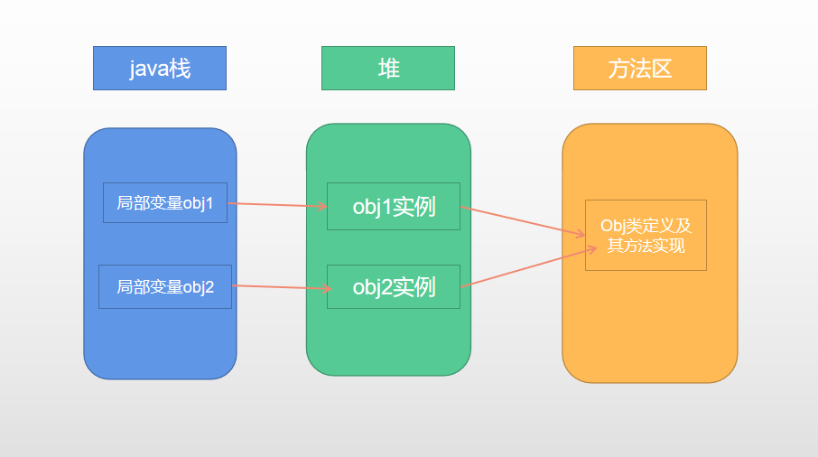

10JVM整体架构

详细图

中文版

代码执行流程

只要遵循字节码规范，就可以被JVM执行

编译器有解释执行器呵JIT即时编译器两部分合用组成。

JIT编译器，对字节码进行二次编译，直接生产二进制代码。好处是以后执行会更快，效率更高。用于反复执行的热点代码。

java是基于栈的架构

指令集更少，但是实现一个功能的需要的指令更多。性能比基于寄存器的架构差。但是需要的资源少，可移植性更强

类加载器，getClassLoader方法和getClass方法

类加载过程

#### 自定义类加载器

原因：

1. 隔离加载类，避免类冲突

2. 修改类加载的方式

3. 扩展加载源

4. 防止源码卸载。对源码进行加密。使用自定义类加载器进行解密

   

步骤

####    运行时方法区

栈帧

 

对象存储

#### 垃圾收集器

红色的线，已废弃

绿色的线，jdk14废弃

