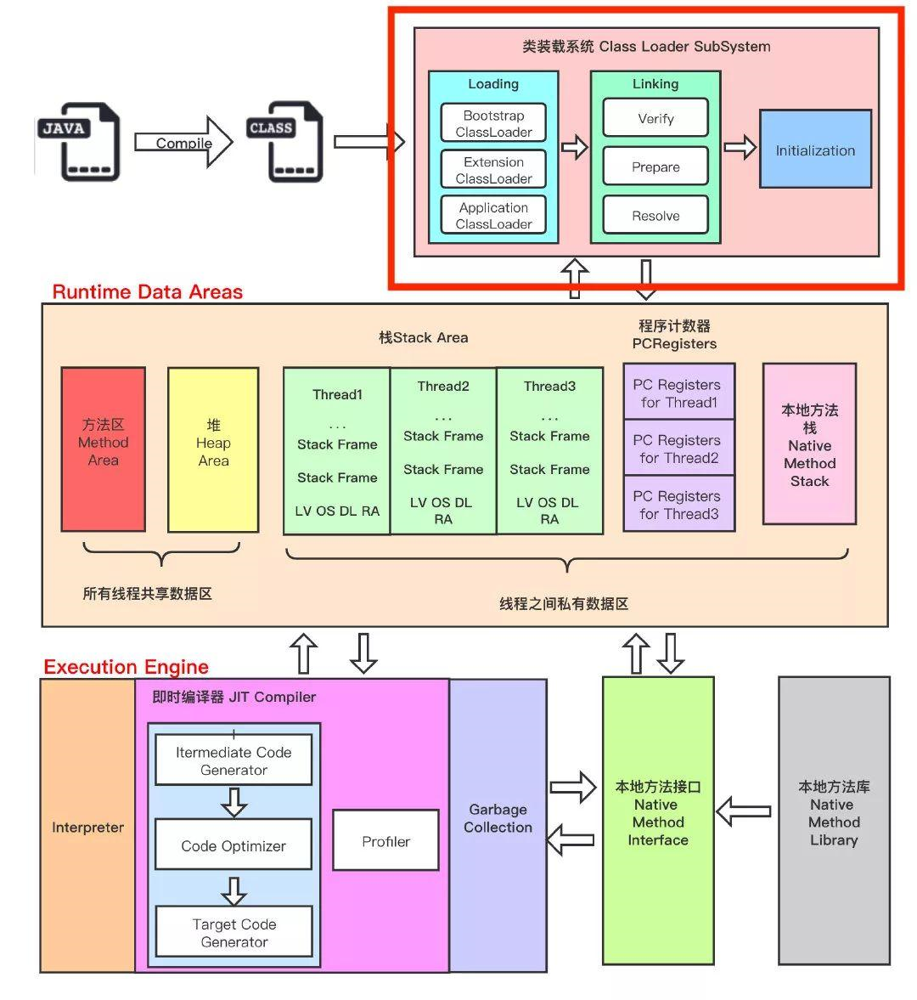

## JVM架构

从上图可以很清晰的看出，jvm架构分成三大部分

- 类加载子系统
- 运行时数据区
- 执行引擎

### 1，类加载子系统

Java的动态类加载功能就是由类加载子系统完成的。类加载子系统在运行时第一次遇到一个class文件时就去加载、链接、初始化class文件。注意是运行时，不是编译时。

#### 1.1 加载

类首先由类加载子系统加载进来。具体分为启动类加载器（BootStrap ClassLoader）、扩展类加载器（Extension ClassLoader）和应用类加载器（Application ClassLoader）三个类加载器。

- 启动类加载器：优先级最高的类加载器。加载的是rt.jar
- 扩展类加载器：负责加载java.ext.dirs系统属性指定的目录下的jar，也会加载jdk安装目录下的jre/lib/ext文件夹下jar，如果我们自己大的jar包，放到这些目录下，也会被扩展类加载器加载。
- 应用类加载器：负责加载应用程序classpath目录下的所有jar和class文件。

加载过程遵循双亲委派机制

#### 1.2 链接

1. 校验：进行二进制代码的合法性验证工作，如果非法会报错。
2. 准备：在这个阶段所有的静态变量会分配内存，并初始化类型的默认值。
3. 解析：所有的符号引用替换成真正的内存地址引用

#### 1.3初始化

类加载的随后阶段。此时进行所有静态变量的初始化，静态代码块也会得到执行。

### 2，运行时数据区

运行时数据区主要分五个部分。

- 方法区

  所有类级别的信息都存在这，包括类的静态变量。一个JVM只有一个方法区，方法区是线程共享的。

- 堆区

  所有的对象实例及其实例变量都存在这。同样一个JVM只有一个堆，堆是线程共享的。

- 栈区

  每个线程有自己独立的栈。栈是线程安全的。每次方法调用产生一个栈帧。所有的本地变量在对应的栈内存中分配。

  一个栈帧又可以分成三部分

  - 局部变量表（Local Variable Array，简称LVA），顾名思义存储本地变量
  - 操作数栈（Operand stack），进行运算
  - 帧数据（Frame data），存放的帧数据用于支持正常方法返回以及异常派发

- PC寄存器

  线程独享，存储当前执行的指令的地址。

- 本地方法栈

  线程独享，存储本地方法执行的信息。

### 3，执行引擎

二进制代码是由执行引擎执行的。执行引擎可以分成三部分。

- 解释器

  解释器解析代码快，但是执行慢。如果一个方法调用多次，对解释器来说，要进行多次解释执行。

- JIT即时编译器

  JIT即时编译器可以弥补解释器的缺点。执行引擎使用解释器编译代码，当它发现重复代码时，使用JIT即时编译器将重复代码转成本地方法代码。这个本地方法代码会在方法重复调用时直接执行，提高了效率。

- 垃圾回收器

### 4，本地方法接口

本地方法接口和本地方法库交互，使执行引擎可以调用本地方法库

### 5，本地方法库

就是本地方法库