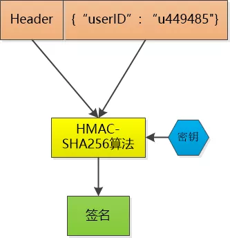
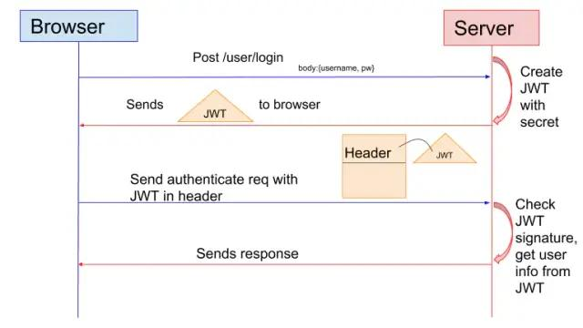

## 从session、cookie到token以及JWT

主要讲token和jwt技术，关于session和cookie文章很多。简单提一下

### session和cookie

现在一般都是session和cookie一起用，一起提。但是他们俩其实不是一定要在一起。

首先牢记一点，**http协议是无状态的**。就是说，一个请求过来，服务器不知道这个请求的用户是不是已经登录过了，不知道他的状态。只能再把这个请求重定向到登陆页面。

这样用户就疯了，怎么一直让我登录。

所以，前人想了一个办法，在第一次登录后，在服务器端记录一个会话id（sessionId），记录一下用户及其状态。然后把sessionId回给浏览器。浏览器将这个sessionId记录到cookie里，下一次请求再带上。这样服务器从请求中拿到cookie里的sessionId，到自己的存储（一般是用redis）里查一下，得到用户的状态。之后就可以愉快的进行下面的操作了。

总之，

1. session是服务器端的，cookie是浏览器端的
2. cookie只是实现session的其中一种方案。虽然是最常用的，但并不是唯一的方法。禁用cookie后还有其他方法存储，比如放在url中
3. 现在后端服务都是分布式部署，session一般统一放在redis集群中。这样有个问题就是一旦redis故障，可能会影响所有的用户请求。

所以，在后台进行session的存储和运维这件事是非常重要和危险的，对可靠性的要求非常高。

**解决问题其实一直有两条路，一是解决问题，二是解决问题本身。**

那么，我们有没有可能不存储session呢？

### token

其实是可以的。这样来一步步思考：

1. 如果我们讲所有信息全部放在cookie里，那么只要cookie将用户的id和状态给服务器传过去就好了。

2. 但是，这样非常危险。用户可以随意伪造cookie，并且非常容易被劫持

3. 所以，问题变成了，怎么确保安全性？

4. 答案就是做签名。在用户第一次登录时，服务端使用如SHA256算法对数据进行加密。就称之为token。

   

   下一次浏览器把加密后的token带过来，服务器再使用相同的算法对数据进行一次加密，比较两次加密的结果，相等即为验证通过。

   

   因为私钥只要服务器知道。所以用户过来的请求时无法伪造的。

这样一来，服务器不需要再费力的保存session数据。服务器端时无状态的。即使流量大增，只要增加服务器即可。

**token的优势：**

- 无状态、可扩展

- 支持移动设备（移动设备是没有cookie的）
- 跨程序调用
- 安全

现在大部分你见到过的API和Web应用都使用token。例如Facebook, Twitter, Google+, GitHub等。

### JWT

我们知道了token技术是个好东西，那么我们怎么用呢？

JWT就是token的一种实现方式，并且基本是java web领域的事实标准。

JWT全称是JSON Web Token。基本可以看出是使用JSON格式传输token

JWT 由 3 部分构成:

1. Header :描述 JWT 的元数据。定义了生成签名的算法以及 Token 的类型。
2. Payload（负载）:用来存放实际需要传递的数据
3. Signature（签名）：服务器通过`Payload`、`Header`和一个密钥(`secret`)使用 Header 里面指定的签名算法（默认是 HMAC SHA256）生成。

**流程：**

在基于 Token 进行身份验证的的应用程序中，用户登录时，服务器通过`Payload`、`Header`和一个密钥(`secret`)创建令牌（`Token`）并将 `Token` 发送给客户端，

然后客户端将 `Token` 保存在 Cookie 或者 localStorage 里面，以后客户端发出的所有请求都会携带这个令牌。你可以把它放在 Cookie 里面自动发送，但是这样不能跨域，所以更好的做法是放在 HTTP Header 的 Authorization字段中：`Authorization: 你的Token`。

### JWT 与 Oauth2.0

Oauth 2.0 是一种授权机制，用来授权第三方应用，获取用户数据，它与 JWT 其实并不是一个层面的东西。Oauth2.0 是一个方便的第三方授权规范，而 JWT 是一个 token 结构规范。只是 JWT 常用来登陆鉴权，而 Oauth2.0 在授权时也涉及到了登陆，所以就比较容易搞混。

