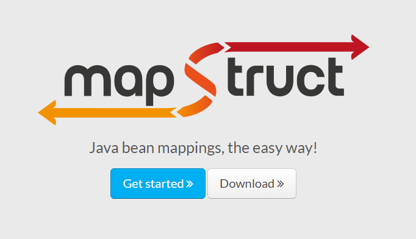

## 使用MapStruct 高效优雅的进行Bean转换

### 烦人的Bean 转换


对于代码中 `JavaBean`之间的转换， 一直是困扰我很久的事情。 在开发的时候我看到业务代码之间有很多的 `JavaBean` 之间的相互转化， 非常的影响观感， 却又不得不存在。 我后来想的一个办法就是通过反射， 或者自己写很多的转换器。

第一种通过反射的方法确实比较方便， 但是现在无论是 `BeanUtils`, `BeanCopier` 等在使用反射的时候都会影响到性能。 虽然我们可以进行反射信息的缓存来提高性能。 但是像这种的话， 需要类型和名称都一样才会进行映射， 有很多时候， 由于不同的团队之间使用的名词不一样， 还是需要很多的手动 set/get 等功能。

第二种的话就是会很浪费时间， 而且在添加新的字段的时候也要进行方法的修改。 不过， 由于不需要进行反射， 其性能是很高的。

### MapStruct 带来的改变

`MapSturct` 是一个生成 类型安全， 高性能且无依赖的 JavaBean 映射代码的注解处理器（annotation processor）。

抓一下重点：

1. 注解处理器
2. 可以生成 `JavaBean` 之间那的映射代码
3. 类型安全， 高性能， 无依赖性

从字面的理解， 我们可以知道， 该工具可以帮我们实现 `JavaBean` 之间的转换， 通过注解的方式。

同时， 作为一个工具类，相比于手写， 其应该具有便捷， 不容易出错的特点。

### `MapStruct` 入门

引入依赖

```maven
<dependency>
    <groupId>org.mapstruct</groupId>
    <artifactId>mapstruct-jdk8</artifactId>
    <version>1.3.1.Final</version>
</dependency>
<dependency>
    <groupId>org.mapstruct</groupId>
    <artifactId>mapstruct-processor</artifactId>
    <version>1.3.1.Final</version>
</dependency>
```

我现在在对接一个系统，传过来的是支付信息PayInfo。后面数据库存的是TExpensesRecords消费记录。我需要进行bean的转换。如果我一点点的写get/set真是太烦人了，无脑的体力劳动。

甚至中间还牵涉了很多类型转换，嵌套之类的繁琐操作，而我们想要的只是建立它们之间的映射关系而已。有没有一种通用的映射工具来帮我们搞定这一切。当然有而且还不少。有人说apache的`BeanUtil.copyProperties`可以实现，但是性能差而且容易出异常，很多规范严禁使用这种途径。以下是对几种对象映射框架的对比，大多数情况下 `MapStruct` 性能最高。原理类似于`lombok` ，`MapStruct`都是在编译期进行实现，而且基于`Getter`、`Setter`,没有使用反射所以一般不存在运行时性能问题。

#### 测试

我现在有两个类

一个是接口VO类

```
@Data
@ApiModel("支付信息")
public class PayInfo {

    @ApiModelProperty("支付码")
    private String payCode;

    @ApiModelProperty("总金额")
    private String totalMoney;

    @ApiModelProperty("菜品")
    private List<Food> foods;

    @ApiModelProperty(value = "服务商id")
    private String serviceId;

    @ApiModelProperty(value = "服务商名称")
    private String serviceName;

    @ApiModelProperty(value = "餐厅编号")
    private String restaurantCode;

    @ApiModelProperty(value = "餐厅名称")
    private String restaurantName;

    @ApiModelProperty(value = "机器号")
    private String machineCode;

    @ApiModelProperty(value = "消费类型（1:食堂用餐、2:网点消费、3:自助贩卖机消费）")
    private String expensesType;
}
```

一个是数据库DO类

```
@Data
@ApiModel(value ="TExpensesRecords", description="消费记录表")
public class TExpensesRecords implements Serializable {
    @ApiModelProperty(value = "")
    private Integer id;

    @ApiModelProperty(value = "交易流水号（随便生成唯一编号）")
    private String tradeId;

    @ApiModelProperty(value = "员工号")
    private String userCode;

    @ApiModelProperty(value = "服务商id")
    private String serviceId;

    @ApiModelProperty(value = "服务商名称")
    private String serviceName;

    @ApiModelProperty(value = "餐厅编号")
    private String restaurantCode;

    @ApiModelProperty(value = "餐厅名称")
    private String restaurantName;

    @ApiModelProperty(value = "机器号")
    private String machineCode;

    @ApiModelProperty(value = "消费类型（1:食堂用餐、2:网点消费、3:自助贩卖机消费）")
    private String expensesType;

    @ApiModelProperty(value = "消费金额")
    private BigDecimal amount;

    @ApiModelProperty(value = "消费时间")
    private LocalDateTime expensesDate;
```

可以看到，他们有一些属性是同名的。

我们一步步来写。

先写一个转换接口


写一个测试类

```
@Test
public void payInfo2ExpenseRecord() throws Exception {
    PayInfo payInfo = new PayInfo();
    payInfo.setPayCode("20200513_01471111_120_40_1589359038744");
    payInfo.setTotalMoney("39.3");
    payInfo.setServiceId("001");
    payInfo.setServiceName("服务商A");
    payInfo.setRestaurantCode("A001");
    payInfo.setRestaurantName("餐厅A");
    payInfo.setMachineCode("M001");
    payInfo.setExpensesType("1");

    TExpensesRecords tExpensesRecords =
            PayInfoMapper.INSTANCE.payInfo2ExpenseRecord(payInfo);

    log.info(tExpensesRecords.toString());
}
```


可以看到，大部分相同名字的属性已经完成转换。但是名字不一致的，需要我们单独配置下。


处理不同名的属性


代码也很好理解，就是将源的payCode字段映射到目标的tradeId字段

看下测试结果

```
TExpensesRecords(id=null, tradeId=20200513_01471111_120_40_1589359038744, userCode=null, serviceId=001, serviceName=服务商A, restaurantCode=A001, restaurantName=餐厅A, machineCode=M001, expensesType=1, amount=39.3, expensesDate=null)
```

tradeId映射成功。而且totalMoney是String，映射成BigDecimal的amount也成功了

#### 原理


原理类似于`lombok` ，`MapStruct`都是在编译期对接口进行实现，而且基于`Getter`、`Setter`,没有使用反射所以一般不存在运行时性能问题。	类型不同，会自动进行转换。


#### Spring 注入的方式

上面的例子是默认的方式

```
    PayInfoMapper INSTANCE = Mappers.getMapper(PayInfoMapper.class);
```

在正常的项目中，一般和spring整合使用

就是在 @Mapper 后面加入 componentModel="spring"


在用到的地方就可以使用@Autowired注入了


#### 注解说明

```
@Mapper 只有在接口加上这个注解， MapStruct 才会去实现该接口
    @Mapper 里有个 componentModel 属性，主要是指定实现类的类型，一般用到两个
    default：默认，可以通过 Mappers.getMapper(Class) 方式获取实例对象
    spring：在接口的实现类上自动添加注解 @Component，可通过 @Autowired 方式注入
@Mapping：属性映射，若源对象属性与目标对象名字一致，会自动映射对应属性
    source：源属性
    target：目标属性
    dateFormat：String 到 Date 日期之间相互转换，通过 SimpleDateFormat，该值为 SimpleDateFormat              的日期格式
    ignore: 忽略这个字段
@Mappings：配置多个@Mapping
@MappingTarget 用于更新已有对象
@InheritConfiguration 用于继承配置
```



#### 高级使用

##### 多对一

两个源对象都有同样的字段，需要指定使用哪个

```
@Mappings({
        @Mapping(source = "bankcardInfo.bankCardNo", target = "bankCardNo")
})
PayChannelVo buildPayChannelVo(TUserBankcardInfo bankcardInfo, TBankcardSupport bankcardSupport);
```

类型转换

##### List和String互转

需求背景：有一个业务对象，数据库里村的是分号隔开的String，在返回给前台是需要转换成List

dao类中

```
@ApiModelProperty(value = "附件地址，以分号隔开")
private String attachments;
```

vo类中

```
@ApiModelProperty(value = "附件地址列表")
private List<String> attachmentList;
```

mapStruct类中的写法

```
@Mapper(componentModel = "spring")
public interface NoticeExchange {
    @Mappings({
            @Mapping(source = "attachments", target = "attachmentList"),
            @Mapping(source = "types", target = "typeList")
    })
    NoticeVo dao2Vo(TNotice dao);

    @Mappings({
            @Mapping(source = "attachmentList", target = "attachments"),
            @Mapping(source = "typeList", target = "types")
    })
    TNotice vo2dao(NoticeVo vo);

    // str转list
    default List<String> str2List(String src){
        String[] split = src.split(";");
        List<String> result = Arrays.asList(split);
        return result;
    }

    // list转str
    default String list2Str(List<String> src){
        if (CollUtil.isEmpty(src)) {
            return "";
        }
        StringBuffer sb = new StringBuffer();
        src.stream().forEach(item -> sb.append(item).append(";"));
        return sb.toString();
    }
}
```

当需要String转List时，MapStruct会自动调用str2List。当需要list转string时，会自动调用

list2Str