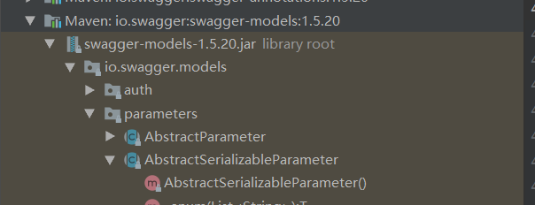
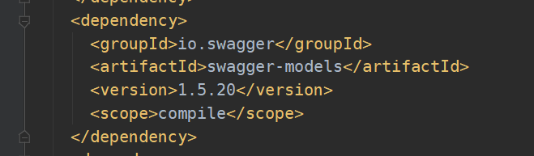
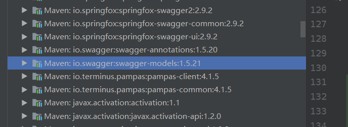

今天发现项目启动时，会打印一堆报错。吓了一跳。

查看之后发现是swagger的错误提示。并不影响功能。但是看着一堆错误，也闹心不是？

所以还是要解决一下。

```
2020-11-04 10:50:46,383 [http-nio-9292-exec-3] WARN  i.s.m.parameters.AbstractSerializableParameter:421 - Illegal DefaultValue null for parameter type integer
java.lang.NumberFormatException: For input string: ""
	at java.lang.NumberFormatException.forInputString(NumberFormatException.java:65)
	at java.lang.Long.parseLong(Long.java:601)
	at java.lang.Long.valueOf(Long.java:803)
	at io.swagger.models.parameters.AbstractSerializableParameter.getExample(AbstractSerializableParameter.java:412)
```

通过查看AbstractSerializableParameter412行的源码

```
            if (BaseIntegerProperty.TYPE.equals(type)) {
                return Long.valueOf(example);
```

发现如果属性类型是Integer，那么就转成Long

而example默认为"",导致转换错误。

### 第一种做法

所以，得到解决方法1：

实体类中，Integer类型的属性加@ApiModelProperty时，必须要给example参数赋值，且值必须为数字类型。

```
@ApiModelProperty(value = "", example = "0")
private Integer id;
```

但是，如果项目中有大量的修改点，那改动起来就太累了。

### 第二种做法

然后再看这个代码

```
        if (example == null) {
            return null;
        }
```

在前面有个null判断，如果加个“”空字符串判断其实也就ok了

但是，这需要我们能下载swagger的源码，自己打包发布。

然后替换掉官方版本

### 第三种做法

这可以算是swagger的一个小bug，在网上看到说这个问题是swagger-models:1.5.20的bug。

看了下我这确实是这个版本。



1.5.21版本已经修改了这个问题，所以我们也可以通过替换依赖解决

swagger-models是springfox-swagger2依赖进来的

```
			<dependency>
                <groupId>io.springfox</groupId>
                <artifactId>springfox-swagger2</artifactId>
                <version>2.9.2</version>
            </dependency>
```

查看了下他的依赖，是1.5.20版本



然后查看了最新的3.0.0版本的springfox-swagger2，依赖的依然是1.5.20的swagger-models

所以只能手动指定swagger-models的版本。话说回来即使高版本的swagger2依赖了1.5.21的models，我也不敢直接升级springfox-swagger2，毕竟这动作有点大。需要做全面的回归测试才敢发生产。

```
<!--Swagger-UI API文档生产工具-->
<dependency>
    <groupId>io.swagger</groupId>
    <artifactId>swagger-models</artifactId>
    <version>1.5.21</version>
</dependency>
<dependency>
    <groupId>io.springfox</groupId>
    <artifactId>springfox-swagger2</artifactId>
    <version>2.9.2</version>
</dependency>
```

通过在springfox-swagger2依赖之前，手工加上swagger-models1.5.21版本的依赖

根据maven的依赖原则，同路径长度下，谁先声明谁优先，把1.5.21放在上面，即可排除springfox-swagger2依赖的1.5.20版本

不需要手动加exclusions



推荐第三种做法。我这边发版测试ok。