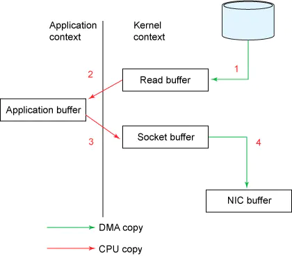
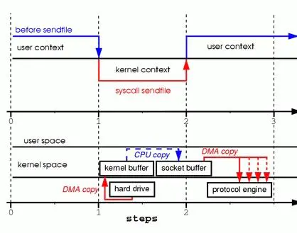
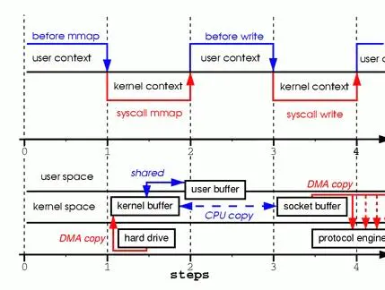

## Linux零拷贝

很多人都听过零拷贝zero-copy的大名，知道在很多牛掰的中间件（比如rocketmq）中为了提高效率，都是用了这项技术。

但是，zero-copy到底是怎么回事？

今天我想把他彻底搞明白。

### 什么是zero-copy

为了搞明白一个技术方案，首先我们应该搞明白这个技术是为了解决什么问题。先理解问题，才能理解答案。

我们先看一个简单的场景，服务器需要将磁盘文件中的数据通过网络发送给客户端。在这个场景下都发生了什么？

你可能觉得这只是两个系统间的调用，数据从一个服务器copy到另一台服务器。但事实上，在操作系统层面发生的事情要复杂得多。

在传统模式下，至少会copy四次数据，下面会细讲。所以，为了减少copy次数，提高效率，诞生了zero-copy方案。

zero-copy并不是真的一次都不copy，而是站在内核空间的角度讲，没有进行内核空间和用户空间之间的copy。

看不懂这几个名词没关系，下面会细讲。

### 前置知识

#### Linux系统的“用户空间”和“内核空间”

首先要知道，Linux操作系统分为【用户态user context】和【内核态 kernel context】，

从Linux系统上看，除了引导系统的BIN区，整个内存空间主要被分成两个部分：内核空间(Kernel space)、用户空间(User space)。“用户空间”和“内核空间”的空间、操作权限以及作用都是不一样的。文件操作、网络操作需要涉及这两种上下文的切换，免不了进行数据复制。

内核空间是Linux自身使用的内存空间，主要提供给程序调度、内存分配、连接硬件资源等程序逻辑使用；

用户空间则是提供给各个进程的主要空间。用户空间不具有访问内核空间资源的权限，因此如果应用程序需要使用到内核空间的资源，则需要通过系统调用来完成：从用户空间切换到内核空间，然后在完成相关操作后再从内核空间切换回用户空间

#### **DMA**

 DMA(Direct Memory Access) ———— 直接内存访问 ：DMA是允许外设组件将I/O数据直接传送到主存储器中并且传输不需要CPU的参与，以此将CPU解放出来去完成其他的事情。
 而用户空间与内核空间之间的数据传输并没有类似DMA这种可以不需要CPU参与的传输工具，因此用户空间与内核空间之间的数据传输是需要CPU全程参与的。所有也就有了通过零拷贝技术来减少和避免不必要的CPU数据拷贝过程。

### 传统做法

在普通的做法中，这个简单的数据复制过程，至少经过了4次的数据复制。

下面这张图，上半部分是上下文的切换，下半部分是数据复制操作

已java为例讲解

第一步：首先jvm向操作系统发出read()系统调用，此时会要将上下文从用户态切换到内核态。将数据从磁盘copy到内核地址空间buffer中，这一步copy是由DMA（直接内存访问）引擎执行的，这是第一次copy

第二步：linux的read操作结束退出，此时会将上下文切换回用户态，同时将数据从内核缓冲区拷贝到用户空间缓冲区。这里用的是CPU。这是第二次copy

之后需要将数据写给网卡进行发送

第三步：jvm向OS发起write()系统调用。系统上下文由用户态切换为内核态。系统的write操作将数据从用户空间buffer复制到内核空间的socket buffer。现在数据又回到了内核buffer，当然这和第一步的内核buffer不是一个空间。这是第三次copy。用的是cpu。

第四步：write操作返回，系统切换回用户态。同时，系统通过DMA将socket buffer中的数据copy到底层硬件（网卡）缓冲区。（这是一个独立且异步的操作，和write操作无关）

下面这个图更清晰些

可以看到，数据在内核空间和用户空间之间，被来来回回的复制。同时伴随着系统上下文的切换。我们知道，上下文切换是CPU密集型的工作，数据拷贝是I/O密集型的工作。如果一次简单的传输就要像上面这样复杂的话，效率是相当低下的。零拷贝机制的终极目标，就是消除冗余的上下文切换和数据拷贝，提高效率。

### sendfile

为了做到这点，linux内核从2.1版本开始，提供了名为sendfile()的系统调用。不仅能减少数据copy，而且能减少系统上下文切换。

看图，从图的上半部分看出，sendfile方式，只有2次上下文的切换。

在数据copy方面。

第一步，从硬盘copy进内核空间，DMA。

第二步，内核buffer到socket buffer的copy。用的cpu。注意这里的copy只在内核空间，不涉及用户空间。

第三步，从socket buffer 到网卡，DMA

ok，目前我们省了1次上下文切换，省了内核空间和用户空间的cpu copy

但是，我们看到在内核空间中，还有一次cpu copy。直觉告诉我们，这次copy还是没有什么用。

为什么会有这一步呢？

这是因为在一般的Block DMA方式中，源物理地址和目标物理地址都得是连续的，所以一次只能传输物理上连续的一块数据，每传输一个块发起一次中断，直到传输完成，所以必须要在两个缓冲区之间拷贝数据。

那么能否省去这一步呢？

#### 对Scatter/Gather的支持的IO

Scatter/Gather技术的意思是分散然后收集。

从kernel 2.4版本开始，socket buffer的描述符做了优化。描述符中包含有数据的起始地址和长度。传输时只需要遍历链表，按序传输数据，全部完成后发起一次中断即可，效率比Block DMA要高。也就是说，硬件可以通过Scatter/Gather DMA直接从内核缓冲区中取得全部数据，不需要再从内核缓冲区向Socket缓冲区拷贝数据。

这样，又省区了cpu拷贝。

到现在为止，从用户空间角度看，是0次copy。从CPU的角度看，也是0次copy。

所以zero-copy完成。

那么，现在是不是完美了呢？其实是有一个问题的。

现在数据一直在内核空间，用户空间没有数据，那么我们的程序就不能对数据进行任何修改操作。如果我们有修改的需求，sendfile实现是不行的。

进而，引出了下面这个。

### mmap

mmap是内存映射。他要比sendfile效率差，但是比传统方式又高效的一种方案。

mmap的特点是，不会将数据从内核空间copy到用户空间。而是在用户空间共享内核空间的数据。从而可以对数据进行修改。

从效率上来说，mmap也是有4次上下文切换，和三次的数据copy。相比传统方式是省了一次cpu copy。

#### java的NIO

java的NIO中，常用的FileChannel。有个map方法，FileChannel的map方法会返回一个MappedByteBuffer。MappedByteBuffer是一个直接字节缓冲器，该缓冲器的内存是一个文件的内存映射区域。map方法底层是通过mmap实现的，因此将文件内存从磁盘读取到内核缓冲区后，用户空间和内核空间共享该缓冲区。

