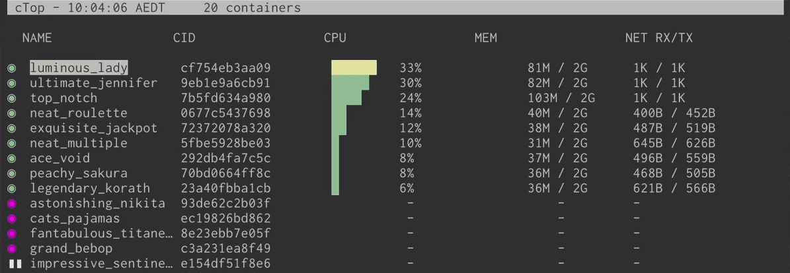
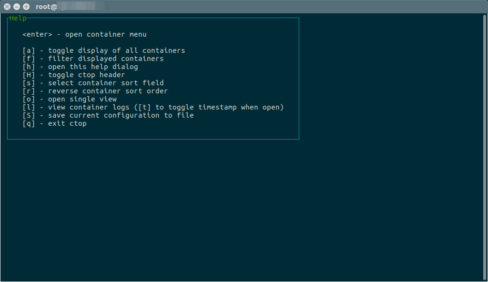
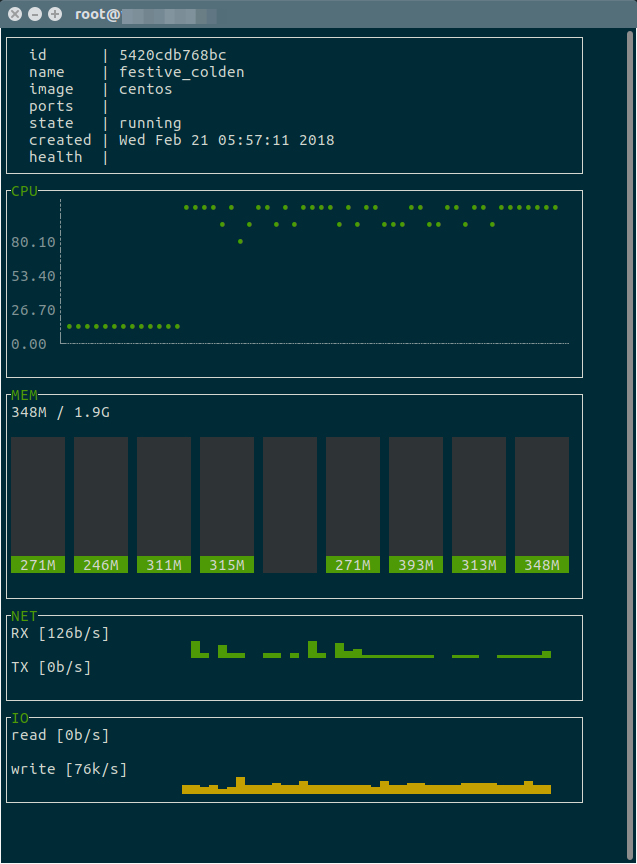

## CTOP的安装和使用

### CTOP是什么

ctop是一个命令行工具，作用是帮助我们查看和监控容器状态。ctop的意思也就是container的top命令。

我们经常使用top命令来查看linux服务器的状况，在使用docker容器时，我们也想看下容器使用的cpu、内存等的状态，一方面我们可以依靠 Portainer 和 Rancher等图形化界面，但是如果像顺手看一下，而不想浪费时间去找页面。这时候ctop就排上用场了。

ctop可以显示很多容器指标，比如 CPU 利用率、内存利用率、磁盘 I/O 读写、进程 ID（PID）和网络发送（TX - 从此服务器发送）以及接受（RX - 此服务器接受）等。

### ctop工具安装

ctop是一个开源工具。源码在github开源https://github.com/bcicen/ctop

安装步骤README里写的很清楚。

我这里使用的是linux centos服务器，所以只写下linux写的使用。

```
sudo wget https://github.com/bcicen/ctop/releases/download/v0.7.5/ctop-0.7.5-linux-amd64 -O /usr/local/bin/ctop
sudo chmod +x /usr/local/bin/ctop
```

这两句命令就行了。

1，是下载工具

2，给ctop赋予执行权限

### ctop的使用

和使用`top`命令一样简单，直接执行`ctop`。就会显示当前各个容器的实时情况。



#### 快捷键

掌握一下快捷键，你会发现太舒服了。

| Key     | Action                            | 使用频率 |
| ------- | --------------------------------- | -------- |
| <ENTER> | 打开操作菜单。                    | 常用     |
| a       | 显示所有容器，包括stop状态的。    | 一般     |
| f       | 开启过滤功能。                    | 常用     |
| H       | 是否显示header。                  | 不用     |
| h       | 帮助对话框                        | 一般     |
| s       | 排序。可以按照cpu，内存等不同维度 | 一般     |
| r       | 反序。                            | 一般     |
| o       | 查看选择的容器的详细状态信息      | 常用     |
| l       | 查看选中的容器的日志              | 常用     |
| e       | 进入容器的shell状态               | 常用     |
| c       | 配置显示的列                      | 不用     |
| S       | 保存设置                          | 不用     |
| q       | 退出ctop                          | 常用     |



对于我来说，最常用的就是l和e。

以前查看容器里的日志，要先docker ps 复制一下容器id。

然后 `docker logs`命令，现在只要按下`l`即可 

以前进入容器，要敲下`docker exec -it 容器id bash或sh`,现在只要按下`e`

方便多了。

按o显示的容器内部详情



