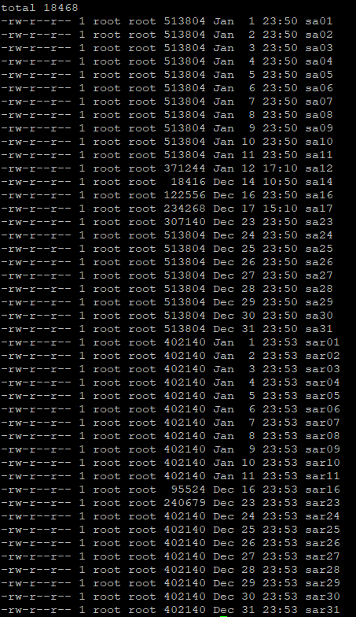

## sar命令

sar需要先安装


### 历史记录

sar的历史记录存在/var/log/sa目录下



存储了一个月的记录,后面的数字是日期

直接打开是乱码的，要先导出

```
sar -A -f /var/log/sa/sa11 > monitor.txt
```

然后可以使用可视化工具打开，也可以直接txt查看

可视化工具如kSar。开源工具，github搜索下载。

https://github.com/vlsi/ksar


