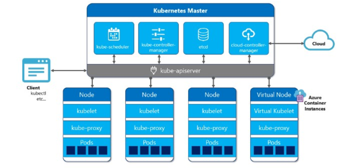

## K8S基础知识

### K8S解决的问题

我们希望在生产环境下做到服务永不中断，如果应用的容器挂掉，我们希望有一种机制能及时拉起一个新的应用容器，保障服务的可用性。

这就是K8S解决的问题。除此之外，k8s还能提供很多有用的特性

- 服务发现和负载均衡

- 存储编排，可以选择性的挂载存储

- 自动化的部署和回滚

- 自动控制资源使用

- 自我修复

- 存储敏感信息

所以K8S并不是一个传统意义上包罗一切的PaaS平台。

### K8S架构

K8S集群的节点分成两种角色，Master节点和Node节点。

K8S架构简单来说就是一个Master节点管理一群Node节点。

Master节点上不存储容器，只负责调度。

#### Master节点

- api-server，k8s的网关，所有的指令请求都必须经过api-server

- scheduler，调度器。根据调度算法，将请求资源调度到某一个node节点

- controller，控制器，维护k8s资源对象。

- etcd，存储资源对象。

#### Node节点

- kubelet，执行资源操作指令。

- kube-proxy，代理服务，处理服务间的负载均衡

- pods，pod是k8s管理的最小单元。pod的内部是容器。也就是说k8s不直接操作容器，而是通过pod来管理容器。

  pod也是一个容器，pod是一个用来装docker容器的容器。
  
  一个pod内部可以是一个容器，也可以是多个容器。pod可以理解为一台独立主机，有自己的ip地址和主机名，可以起一个或多个docker容器。
  
  通常情况下，在服务部署时候，使用 Pod 来管理一组相关的服务。一个 Pod 中要么部署一个服务，要么部署一组有关系的服务。
  
  ##### pod网络
  
  每个pod有自己独立的ip地址，一个pod内部的容器之间用localhost访问，相当于访问本地服务，性能很高。但是不同pod之间的访问属于远程通信。
  
  **Pod 对外提供服务访问**
  Pod 是虚拟的资源对象（进程），没有对应实体（物理机，物理网卡）与之对应，无法直接对外提供服务访问。
  Pod 如果想要对外提供服务，必须绑定物理机端口。也就是说在物理机上开启端口，让这个端口和 Pod 的端口进行映射，这样就可以通过物理机进行数据包的转发。
  概括来说：先通过物理机 IP + Port 进行访问，再进行数据包转发。
  
  ##### pod的负载均衡
  
  pod是一个进程，是有生命周期的。宕机、版本更新等，都会创建新的pod，IP地址和hostname都会变化，所以不能使用ip做负载均衡。

### 存储

#### 卷Volume

