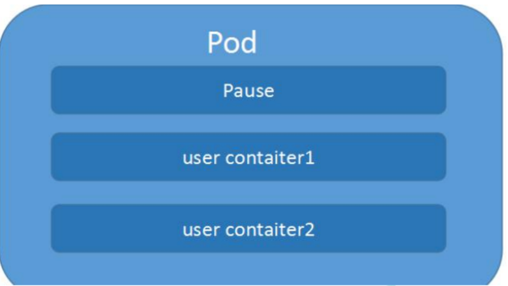

## K8S基础知识

### K8S解决的问题

我们希望在生产环境下做到服务永不中断，如果应用的容器挂掉，我们希望有一种机制能及时拉起一个新的应用容器，保障服务的可用性。

这就是K8S解决的问题。除此之外，k8s还能提供很多有用的特性

- 服务发现和负载均衡

- 存储编排，可以选择性的挂载存储

- 自动化的部署和回滚

- 自动控制资源使用

- 自我修复

- 存储敏感信息和配置，可在不重新构建镜像的情况下，更新秘钥或配置。


所以K8S并不是一个传统意义上包罗一切的PaaS平台。

### K8S架构

K8S集群中的机器被称为节点。

K8S集群的节点分成两种角色，Master节点和Node节点。


K8S架构简单来说就是一个Master节点管理一群Node节点。

Master节点上不存储容器，只负责调度。


#### Master主控节点

- api-server，k8s的网关，所有的指令请求都必须经过api-server。这是master节点（也称控制层面）的核心，我们用的kubectl命令背后也是调用api-server

- scheduler，调度器。监控新创建的未指定运行节点的pod，根据调度算法，选择一个节点运行该pod。

- controller-manager，控制器，处理急群众常规的后台任务，维护k8s资源对象。有多种控制器，负责故障通知、任务执行、访问令牌等多种任务。

- etcd，键值数据库，用来保存集群数据的数据库

#### Node工作节点

- kubelet，是master在node中的代理。执行资源操作指令，确保pod状态健康。

- kube-proxy，代理服务，处理服务间的负载均衡

- 容器运行时

### 核心概念

#### Pod

pods，pod是k8s管理的最小单元。pod的内部是容器。pod是一组容器的集合。也就是说k8s不直接操作容器，而是通过pod来管理容器。

pod也是一个容器，pod是一个用来装docker容器的容器。

一个pod内部可以放一个容器，也可以是多个容器。pod可以理解为一台独立主机，有自己的ip地址和主机名，可以起一个或多个docker容器。

通常情况下，在服务部署时候，使用 Pod 来管理一组相关的服务。一个 Pod 中要么部署一个服务，要么部署一组有关系的服务。

##### pod网络

容器本身相互之间是隔离的，根据linux的namespace和group实现。

但是一个pod中的多个容器是共享网络的。

每个pod有自己独立的ip地址，一个pod内部的容器之间用localhost访问，相当于访问本地服务，性能很高。但是不同pod之间的访问属于远程通信。

##### Pod 对外提供服务访问

Pod 是虚拟的资源对象（进程），没有对应实体（物理机，物理网卡）与之对应，无法直接对外提供服务访问。
Pod 如果想要对外提供服务，必须绑定物理机端口。也就是说在物理机上开启端口，让这个端口和 Pod 的端口进行映射，这样就可以通过物理机进行数据包的转发。
概括来说：先通过物理机 IP + Port 进行访问，再进行数据包转发。

##### pod的负载均衡

pod是一个进程，是有生命周期的。宕机、版本更新等，都会创建新的pod，IP地址和hostname都会变化，所以不能使用ip做负载均衡。

##### pod的内部

每一个 Pod 内部都有一个特殊的被称为”根容器“的 Pause 容器。Pause 容器对应的镜像是属于 Kubernetes 平台的一部分，除了 Pause 容器，每个 Pod 

还包含一个或多个紧密相关的用户业务容器。也是通过pause容器实现了pod的共享




##### pod创建流程


- master节点
  1. 创建pod的命令发送给api-server。api-server存储到etcd
  2. scheduler监听到api-server的创建pod动作，通过调度算法指定一个node节点创建。将相关信息发送api-server，由api-server存到etcd
- node节点

  1. 监听到api-server上自己要创建的pod
  2. 调用docker创建容器
  3. 将创建的状态返回给api-server，再由api-server存etcd

可以看到所有组件都是通过api-server交互，只有api-server才能操作etcd存储。

##### pod的调度

影响调度的属性：

 1. pod的资源限制

 2. 节点选择器标签。nodeSelector

    首先要给node节点设置上标签。使用label命令

	3. 节点亲和性。nodeAffinity

    - 硬亲和性

      约束条件必须满足

    - 软亲和性

      尝试满足，不保证。

	4. 污点和污点容忍。taint

    nodeSelector和nodeAffinity是pod的属性

    taint是node节点的属性。

    查看节点的污点情况：

    ```
     # kubectl describe node dev-master-1 | grep Taint
     Taints:             node-role.kubernetes.io/master:NoSchedule
     
     # kubectl describe node dev-node-1 | grep Taint
    Taints:             <none>
    ```

    master节点的污点值是NoSchedule。

    污点值有三种：

    - NoSchedule：一定不会被调度到
    - PreferNoSchedule：尽量不被调度到
    - NoExecute：一定不会被调度，并且还会驱逐node中已有的pod

    所以，master节点是NoSchedule。

    node节点现在没有污点。使用taint命令给node节点添加污点设置。

    ```
    kubectl taint node dev-node-1 env_role=yes:NoSchedule
    ```

    `env_role=yes是我自己设置的污点key`

    删除污点

    ```
    kubectl taint node dev-node-1 env_role:NoSchedule-
    ```

    

    应用场景：

    - 专用节点
    - 配置特定硬件节点
    - 基于污点驱逐

#### Controller

##### 什么是controller

管理和运行容器的一个对象，是实际存在的，不想pod只是一个抽象的概念。

k8s中有多种controller。如deployment。

还有另一种叫法，工作负载。和controller控制器一回事，叫法不同而已。

##### pod和controller的关系

pod通过controller实现应用的运维。比如应用的伸缩，滚动升级。

确保预期的pod副本的数量。

pod和controller是通过label标签和selector建立关系。

##### deployment控制器

最常用的一个控制器。

使用场景

- 部署**无状态**的应用。如web服务，微服务应用。

  使用yaml文件进行部署：`kubectrl apply -f xx.yaml`

- 管理pod和replicaSet

- 部署，滚动升级，弹性伸缩等功能

  ```
  kubectl set image 应用名 新版本
  ```

  升级镜像，滚动部署新版本

  ```
  kubectl rollout status deployment 应用名
  ```

  查看升级状态

  ```
  kubectl rollout history deployment 应用名
  ```

  查看升级的历史

  ```
  kubectl rollout undo deployment 应用名
  ```

  回滚应用到上一个版本

  ```
  kubectl rollout undo deployment 应用名 --to-revision=某个版本
  ```

  回滚应用到指定版本

  

  ```
  kubectl scale deployment 应用名 --replicas=数量
  ```

  弹性伸缩

##### StatefulSet控制器

有状态的controller。持久化存储。

有状态的容器需要保证pod的唯一性，启动的有序性。

有状态的应用的pod会生成一个唯一的网络标识符。在yaml中配置service的clusterIp：none设置pod的ip为none

每个有状态的pod也会自动生成唯一域名，格式为：主机名称.service名称.名称空间.svc.cluster.local

##### DeamonSet守护进程

部署一个守护进程pod

##### job和cronjob

job：一次性任务

cronJob：定时任务

#### Service

定义一组pod的访问规则。

我们访问应用先访问的是service。

##### 存在的意义

1. 防止pod失联。服务发现机制。

   每个pod都有自己的ip。但是当pod重启时ip会发生变化。所以将pod先向service注册，可以通过service找到pod。

   service很像微服务中的注册中心。

2. 负载均衡

service有自己的虚拟ip，vip

##### 常用的service类型

- ClusterIP

  集群内部pod相互之间使用ClusterIP进行访问

- NodePort

  对外暴露接口

- LoadBalancer

  也是对外暴露服务，也可以用于公有云

### kubectl概述

**kubectl 是 Kubernetes 集群的命令行工具**，通过 kubectl 能够对集群本身进行管理。

基本语法： kubectl [command] [type] [name] [flags]

- command 指定要进行的操作，如get，create,apply,describe,delete
- type 指定资源类型。如pod，node。可以单复数，也可以简写。
- name 指定资源的名称。省略显示全部。
- flags 扩展参数。如-s指定api-server的ip的端口。-f 指定文件。

具体的使用kubectl --help查看


#### 常用命令


### Kubernetes Objects对象

K8S中有一个Object（对象）的概念。对象表示的是一种期望的实现。我们用一个yaml文件来描述一个期望得到的对象。K8S会努力去实现我们的这种期望。

比如，在K8S中Deployment 对象能够表示运行在集群中的应用

```
apiVersion: apps/v1
kind: Deployment
metadata:
  name: nginx-deployment
spec:
  selector:
    matchLabels:
      app: nginx
  replicas: 2
  template:
    metadata:
      labels:
        app: nginx
    spec:
      containers:
      - name: nginx
        image: nginx:1.14.2
        ports:
        - containerPort: 80
```

- `apiVersion` - 创建该对象所使用的 Kubernetes API 的版本

- `kind` - 想要创建的对象的类别

- `metadata` - 帮助唯一性标识对象的一些数据，包括一个 `name` 字符串、UID 和可选的 `namespace`

- spec。描述我们对这个应用状态的期望。比如replicas：2表示要运行2个pod

  具体的写法要看官方

  [Kubernetes API Reference Docs](https://kubernetes.io/docs/reference/generated/kubernetes-api/v1.21/#deployment-v1-apps)

### yaml文件

yaml文件是k8s中的资源清单文件，或者叫资源编排文件。

kubectl 命令直接使用yaml文件就可以实现对大量的资源对象进行编排部署。

#### 语法格式

是一种标记语言。

- 通过缩进表示层级关系。必须是空格缩进。
- 开头缩进2个空格。冒号后是1个空格。
- ---三个横线表示一个新的yaml开始。也就是说多个yaml结构可以放在一个yaml文件里
- 使用#注释

#### 组成部分

##### 控制器定义部分

在template字段之前的部分。给controller用的。

##### 被控制的对象部分

template字段部分。

- 必须存在的参数


- spec主要属性

  

  

  

  

- 额外的参数

    

#### 如何快速编写yaml文件

如果从零开始手写一个yaml文件还是比较困难的，尤其是各种缩进，很难保证不出错误。

我们一般是在现成的文件上修改

1. 使用kubectl creaete命令创建一个yaml文件

   ```
   kubectl create deployment my-ng --image=nginx -o yaml --dry-run > my-ng.yaml
   ```

   -o yaml表示将创建过程输出为yaml格式

   --dry-run表示只是尝试运行，不会真正启动部署一个pod

   这种方式适合新创建服务。如果是已有服务，适合用下面的方法。

2. 使用kubectl get 命令获取一个已存在的yaml文件

   ```
   # 我们先创建一个ng服务
   kubectl create deployment nginx --image=nginx 
   kubectl expose deployment nginx --port=80 --type=NodePort #暴露为一个服务
   kubectl get pod,svc
   ```

   获取创建的ng服务的yaml文件

   ```
   kubectl get deployment nginx -o yaml --export => my-ng2.yaml
   ```


### Secret

作用：解决了密码等敏感数据的存储问题。敏感数据可以经过加密存储在etcd中，让pod容器以挂载volumn或者变量的方式进行访问。

使用步骤

1. 创建secret加密数据
2. 以变量的形式挂载到容器中
3. 或者以volumn形式挂载到容器中

### ConfigMap

简写是cm，存储不加密的数据到etcd中。让pod容器以挂载volumn或者变量的方式进行访问。

使用步骤

1. 创建一个配置文件
2. 创建一个configmap，使用上一步创建的配置文件
3. 容器挂载使用

### K8S集群的安全机制

访问k8s集群时需要经过三个步骤：

1. 认证

   进行访问时都需要经过api-server，认证token、证书或者用户名密码等。

   如果要访问pod，还需要经过service，需要serviceAccount。

2. 授权

   基于RBAC进行授权操作，基于角色的访问控制。

3. 准入控制

   准入控制列表。如果列表中有请求的内容，则通过。否则，拒绝。

### Ingress

ingress作为服务统一入口。ingress不是k8s的内置组件，需要额外安装。

NodePort服务模式的不足：每个node节点都需要开放这个端口，然后通过ip+port的形式访问。而生产环境中，一般都是通过域名访问服务。

Ingress和pod的关系：pod和ingress通过service进行关联。


### Helm

#### 是什么？

helm是k8s的包管理工具。可以方便的将之前打包好的yaml文件部署到k8s上。

之前部署一个应用的过程：编写yaml文件 --> 创建service对外暴露 --> 通过ingress域名访问 

这种方式的缺点：只适合简单的应用。实际上我们部署微服务项目，可能有几十个服务，用这种方式就不合适了。需要维护大量的yaml文件。

使用helm的优势：

1. 使用helm可以将大量yaml文件作为一个整体进行管理
2. 实现yaml文件的高效复用。
3. 实现应用级别的版本管理

总之，helm的作用就是让我们在k8s中部署应用更高效。

helm的核心概念：

1. helm

   是一个命令行客户端工具。用于chart的创建、打包、发布。

2. chart

   应用描述，实际上就是把yaml文件的打包。

3. release

   基于chart部署的实体。就是应用的一个版本。


#### helm安装

1. 从helm官网：https://helm.sh/，下载v3版本的安装包

2. 放到服务器上，解压。将helm目录移动到/usr/bin目录下。

3. 配置helm仓库

   添加仓库：helm repo add 仓库名称  仓库地址

   ```
   helm repo add aliyun https://kubernetes.oss-cn-hangzhou.aliyuncs.com/charts
   ```

   添加阿里云的仓库

   ```
   helm repo list  #查看仓库
   helm repo remove aliyun  #删除仓库
   ```

#### 使用helm快速部署应用

1. 快速搜索应用

   helm search repo 名字

2. 根据搜索结果进行安装

   helm install 安装之后的名称 搜索到的应用名称

3. 查看安装状态

   helm list

   helm status 安装之后的名称

##### 使用helm部署redis

#### 自己创建chart，完成部署

1. 使用命令创建chart

   ```
   helm create 自定义chart的名字
   ```

   目录作用：

   - charts：
   - Chart.yaml: 配置chart的基本信息，版本等。
   - templates：自己写的yaml文件放在这
   - valus.yaml: 定义全局变量

2. 在template中创建自己的yaml文件

3. 安装自己的chart

   ```
   helm install 应用名字  自己的chart名字
   ```

4. 更新自己的chart

   ```
   helm upgrade 应用名字  自己的chart名字
   ```

#### 使用helm进行yaml文件复用

通过传递参数，动态渲染yaml模板。做到yaml的高效复用。

1. 在values.yaml中定义变量和值

2. 在具体的yaml文件中，获取定义的变量值

   表达式：{{.Values.变量名称 }}

3. 执行

   ```
   helm install 应用名字  自己的chart名字
   ```

   

### 存储

#### 卷Volume

Volume 是 Pod 中能够被多个容器访问的共享目录。

Kubernetes 的 Volume 定义在 Pod 上， 它被一个 Pod 中的多个容 器挂载到具体的文件目录下。

Volume 与 Pod 的生命周期相同， 但与容器的生命周期不相关，当容器终止或重启时，Volume 中的数据也不会丢失。

#### PV，PVC和SC

- PV的全称是PersistentVolume ，即持久化卷。是集群中的一块存储。是对底层共享存储的一种抽象，底层共享存储可以使用ceph、nfs等，pv通过插件机制与具体的共享存储对接，向上屏蔽底层的实现细节。pv拥有了独立于使用该pv的pod的的生命周期，所以称为持久化。

- PVC的全称是PersistentVolumeClaim，持久化卷申领。表达的是用户申请存储资源。pvc可以类比pod的概念。pod申请的是一定的计算资源（cpu内存等），pvc申请的是一定的存储资源（pv资源）。

- SC全称是StorageClass ，存储类。存储类是一个规则定义。管理员通过提供不同的存储类，可以满足用户不同的服务质量、备份策略等方面的要求。持久型的pvc使用的 预先创建好的nfs或者 node的空间，会一直占用着资源，造成不使用时的浪费。

  而且预先创建好的pvc有可能跟pod不是一个 可用区，将造成 跨可用区的流量费用。

  k8s针对这种情况 有storageclass的用法，可以让用户动态创建pvc。

  

  三者的关系看下图。

  管理员创建sc，用户创建pvc。pvc中声明使用的sc。k8s根据sc创建pv。

  用户使用pvc创建pod，pod使用pvc关联的pv作为volumn。


### 命名空间

Kubernetes 支持多个虚拟集群，它们底层依赖于同一个物理集群。 这些虚拟集群被称为命名空间。

命名空间适合跨多个团队的大型项目，对于只有几到几十个用户的集群，根本不需要创建或考虑名字空间。

名字空间为名称提供了一个范围。资源的名称需要在名字空间内是唯一的，但不能跨名字空间。

```shell
# kubectl get namespace  #查看命名空间

NAME                           STATUS   AGE
default                        Active   3d   #没有指明使用其它名字空间的对象所使用的默认名字空间
kube-node-lease                Active   3d #此名字空间用于与各个节点相关的租期（Lease）对象，使得集群规模很大时节点心跳检测性能得到提升。
kube-public                    Active   3d #这个名字空间是自动创建的，所有用户（包括未经过身份验证的用户）都可以读取它。目的是为了某些资源在所有命名空间中共享
kube-system                    Active   3d #Kubernetes 系统创建对象所使用的名字空间

```


```shell
kubectl get pods -n 查询时加上命名空间
```

