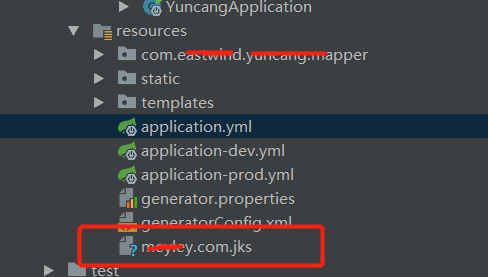
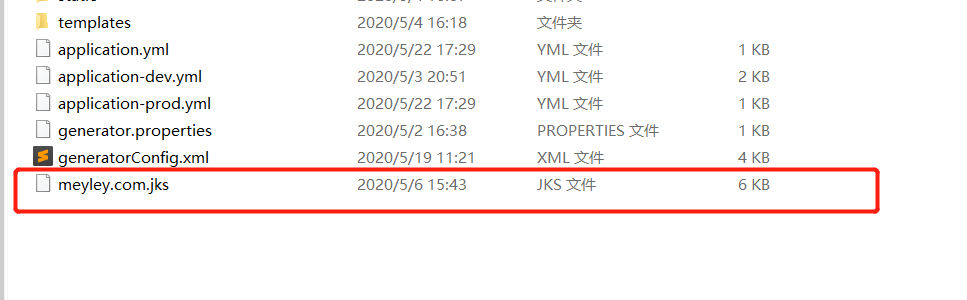
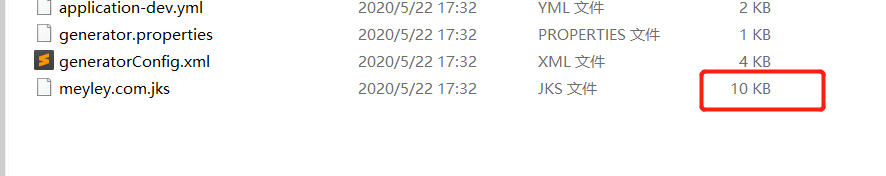

## Springboot配置Https

主要说下我在配置中踩到的一个坑。

我这里有一个老的应用，之前部署在tomcat下，现在用springboot进行了重构。现在直接使用jar包部署，所以需要把之前配置在tomcat中的ssl配置一直到springboot的配置文件下。

### 1，找到ssl文件

之前的tomcat中的配置ssl是在server.xml中，找到对应的配置代码

```
 <Connector port="8443" protocol="org.apache.coyote.http11.Http11NioProtocol"
               maxThreads="150" SSLEnabled="true">
        <SSLHostConfig>
            <Certificate certificateKeystoreFile="conf/xxx.com.jks"
                         certificateKeystorePassword="我的密码"
                         certificateKeyAlias="xxx.com"
                         type="RSA" />
        </SSLHostConfig>
    </Connector>
```

顺藤摸瓜的找到jks文件，下载下来


### 2，springboot中的配置

springboot中的配置也很简单

```
server:
  ssl:
    key-store-type: JKS
    key-store: classpath:xxx.com.jks
    key-store-password: 我的密码
```

key-store指的是jks文件的放置路径，我这里是直接放在resources下面



### 3，启动

这样就算配置完了，简单吧，然后启动。华丽丽的报错了。棒棒的。

我们看下报错：

```
Caused by: java.lang.IllegalArgumentException: Invalid keystore format
```

说我们的文件格式不对。

但是我的这个文件在旧的网站用的好好的，经过比对，我确定文件是没问题的。

后来发现，我的原始jks文件是没有问题，但是经过maven打包之后的jks文件被改动了。



这是原始文件



这是打包中的文件，

可以看到，变成了10k。大小都变了。看来maven真的做了什么操作

### 4，找到原因

我的项目里，使用了maven打包时，进行多环境配置。

```
<resources>
    <resource>
        <directory>src/main/resources</directory>
        <!-- 处理文件时替换文件中的变量 -->
        <filtering>true</filtering>
        <excludes>
            <!-- 打包时排除文件，可自行添加test.yml -->
            <exclude>application.yml</exclude>
            <exclude>application-dev.yml</exclude>
            <exclude>application-prod.yml</exclude>
        </excludes>
    </resource>
    <resource>
        <directory>src/main/resources</directory>
        <filtering>true</filtering>
        <!-- 打包时所包含得文件 -->
        <includes>
            <include>application.yml</include>
            <include>application-${profileActive}.yml</include>
        </includes>
    </resource>
</resources>
```

我这里设置的目录是src/main/resources。所以resources下面的所有文件会被maven打开，并按照规则做一些改动。导致了我的jks文件被破坏。

### 5，解决

改一下maven配置：

```
<resources>
    <resource>
        <directory>src/main/resources</directory>
        <!-- 处理文件时替换文件中的变量 -->
        <filtering>true</filtering>
        <excludes>
            <!-- 打包时排除文件，可自行添加test.yml -->
            <exclude>application.yml</exclude>
            <exclude>application-dev.yml</exclude>
            <exclude>application-prod.yml</exclude>
            <exclude>*.jks</exclude>
        </excludes>
    </resource>
    <resource>
        <directory>src/main/resources</directory>
        <filtering>true</filtering>
        <!-- 打包时所包含得文件 -->
        <includes>
            <include>application.yml</include>
            <include>application-${profileActive}.yml</include>
        </includes>
    </resource>
    <resource>
        <directory>src/main/resources</directory>
        <filtering>false</filtering>
        <includes>
            <include>*.jks</include>
        </includes>
    </resource>
</resources>
```

加上一个，打包时不要处理jks文件的配置

解决。

### 总结

回头想想，这个坑应该可以很快被识别出。因为maven打包后会修改我的yml配置文件。那么按照之前的配置，也会修改我的其他文件。还是对maven打包的理解不深，那么以后要注意，如果加入其他文件到resources下也可能出现这个问题。