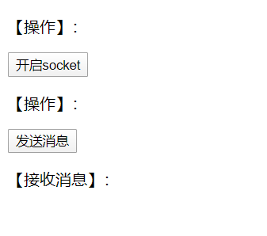
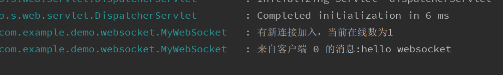
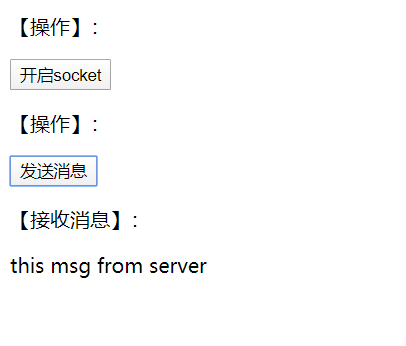

### Springboot下的WebSocket开发

今天遇到一个需求，需要对接第三方扫码跳转。一种方案是前端页面轮询后端服务，但是这种空轮询会虚耗资源，而且也不优雅。所以决定使用另一种方案，websocket。以前就知道websocket，属于长连接，非常适合这种场景的需求。但是一直没机会用，今天正好可以使用一下。

简单记录一下步骤，亲测可用。

1. 引入依赖

```
        <dependency>
            <groupId>org.springframework.boot</groupId>
            <artifactId>spring-boot-starter-websocket</artifactId>
        </dependency>
```

springboot已经非常贴心的为我们编写好了starter

2. 配置config

```
@Configuration
public class WebSocketConfig {

    @Bean
    public ServerEndpointExporter serverEndpointExporter() {
        return new ServerEndpointExporter();
    }

}
```

​	必须有这个config，把ws服务暴露出去。

3. 编写webSocket server

   ```
   @Slf4j
   @Component
   @ServerEndpoint("/webSocket/{id}")
   public class MyWebSocket {
       /**
        * 静态变量 用来记录当前在线连接数
        */
       private static int onlineCount = 0;
   
       /**
        * 服务端与单一客户端通信 使用Map来存放 其中标识Key为id
        */
       private static ConcurrentMap<String, MyWebSocket> webSocketMap = new ConcurrentHashMap<>();
       //不需要区分可使用set
       //private static CopyOnWriteArraySet<WebSocketTest> webSocketSet = new CopyOnWriteArraySet<WebSocketTest>();
   
       public static ConcurrentMap<String, MyWebSocket> getWebSocketMap() {
           return webSocketMap;
       }
   
       /**
        * 与某个客户端的连接会话 需要通过它来给客户端发送数据
        */
       private Session session;
   
       /**
        * 连接建立成功调用的方法
        *
        * @param session 可选的参数 session为与某个客户端的连接会话 需要通过它来给客户端发送数据
        */
       @OnOpen
       public void onOpen(Session session, @PathParam("id") String id) {
           this.session = session;
   
           webSocketMap.put(id, this);
   
           addOnlineCount();
           log.info("有新连接加入，当前在线数为" + getOnlineCount());
       }
   
       /**
        * 连接关闭调用的方法
        */
       @OnClose
       public void onClose() {
           Map<String, String> map = session.getPathParameters();
           webSocketMap.remove(Integer.parseInt(map.get("id")));
   
           subOnlineCount();
           log.info("有一连接关闭！当前在线数为" + getOnlineCount());
       }
   
       /**
        * 收到客户端消息后调用的方法
        *
        * @param message 客户端发送过来的消息
        * @param session 可选的参数
        */
       @OnMessage
       public void onMessage(String message, Session session) {
           log.info("来自客户端 " + session.getId() + " 的消息:" + message);
       }
   
       /**
        * 发生错误时调用
        *
        * @param session
        * @param error
        */
       @OnError
       public void onError(Session session, Throwable error) {
           log.error("LoginResultWebSocket 发生错误");
           error.printStackTrace();
       }
   
       /**
        * 发送消息
        *
        * @param message
        * @throws IOException
        */
       public void sendMessage(String message) throws IOException {
           this.session.getBasicRemote().sendText(message);
       }
   
       public static synchronized int getOnlineCount() {
           return onlineCount;
       }
   
       public static synchronized void addOnlineCount() {
           MyWebSocket.onlineCount++;
       }
   
       public static synchronized void subOnlineCount() {
           MyWebSocket.onlineCount--;
       }
   
   }
   ```

4. 编写测试页面

   页面代码就不贴了，网上很多，需要的可以看github，地址在文章最后。

   就是一个按钮打开socket链接。一个按钮向后端发送消息。一个用来展示从服务端收到的消息的p标签。

   

点击发送消息后，



可以看到，server端已经接收到。


然后测试，页面也可以接收到消息。我写了一个请求，触发一下sendMessage方法。



总结：websocket入门使用还是很简单的，也很有趣。可以用来写个在线聊天室demo。