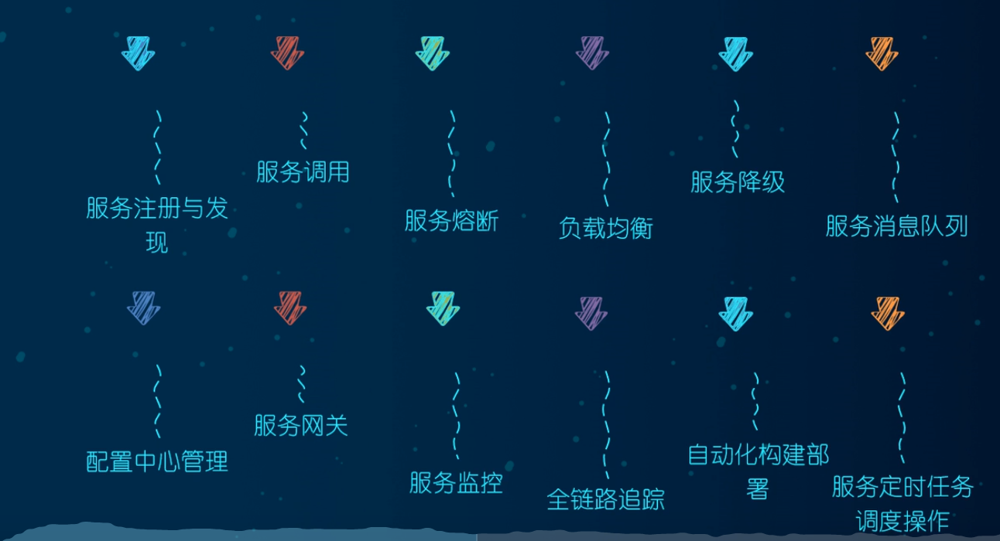
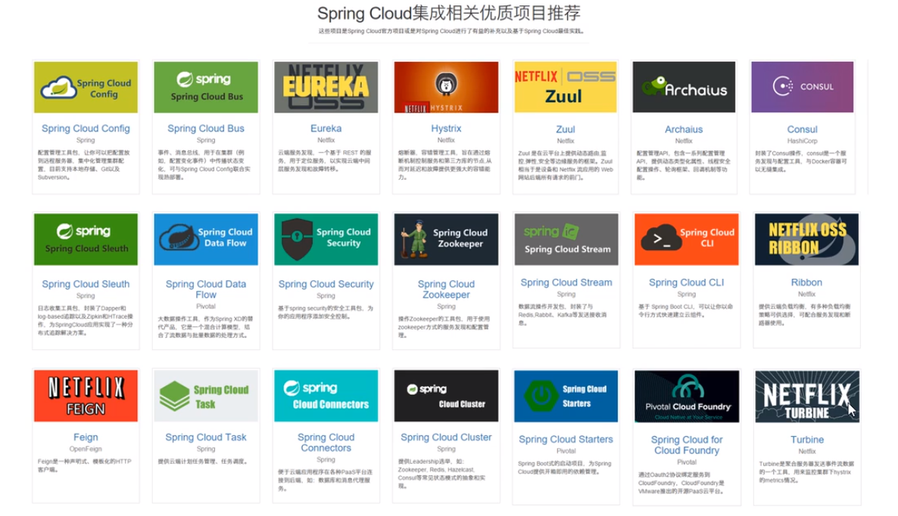
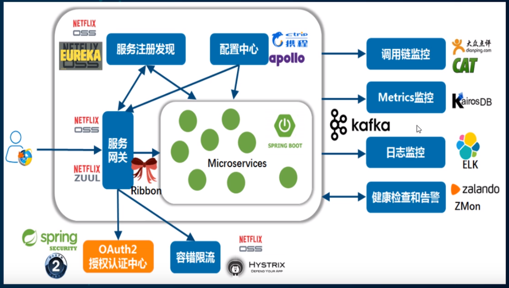
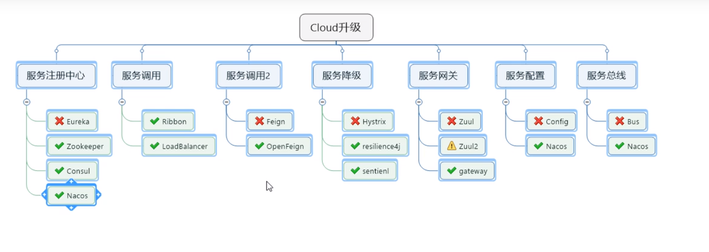
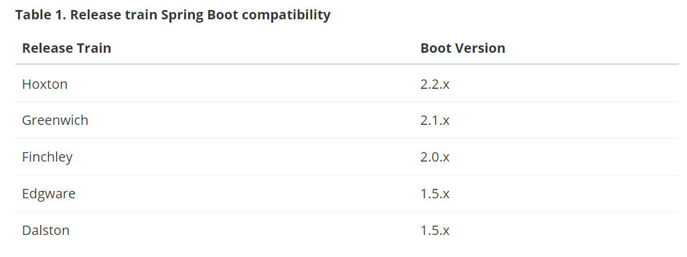
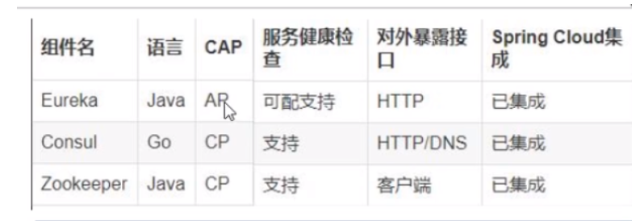
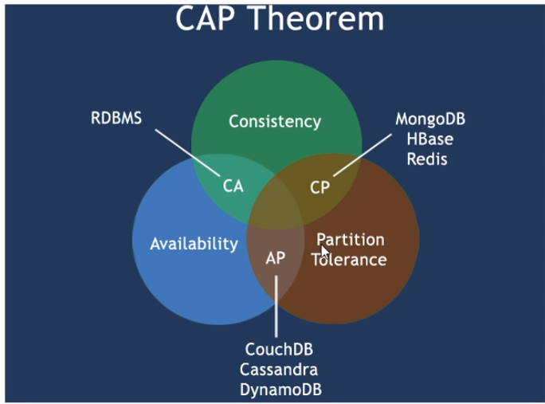
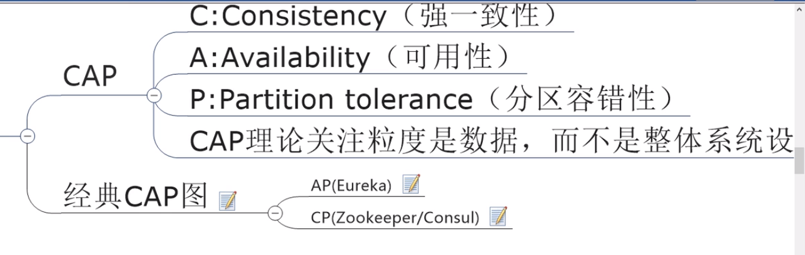
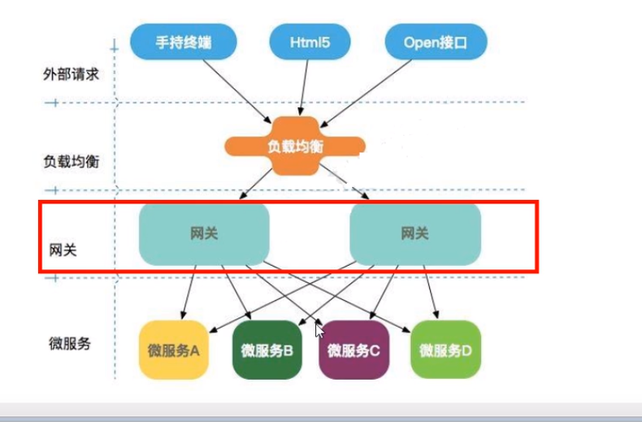

## 1，理论理解

微服务全家桶。








（题外话，架构设计上，业务无关的，剥离出来做公共服务。业务相关的沉淀下来做基础服务。）

### cloud组件升级



### 版本匹配

springcloud和springboot的版本匹配



更具体的版本可以查看：https://start.spring.io/actuator/info

```
"spring-cloud": {
			"Finchley.M2": "Spring Boot >=2.0.0.M3 and <2.0.0.M5",
			"Finchley.M3": "Spring Boot >=2.0.0.M5 and <=2.0.0.M5",
			"Finchley.M4": "Spring Boot >=2.0.0.M6 and <=2.0.0.M6",
			"Finchley.M5": "Spring Boot >=2.0.0.M7 and <=2.0.0.M7",
			"Finchley.M6": "Spring Boot >=2.0.0.RC1 and <=2.0.0.RC1",
			"Finchley.M7": "Spring Boot >=2.0.0.RC2 and <=2.0.0.RC2",
			"Finchley.M9": "Spring Boot >=2.0.0.RELEASE and <=2.0.0.RELEASE",
			"Finchley.RC1": "Spring Boot >=2.0.1.RELEASE and <2.0.2.RELEASE",
			"Finchley.RC2": "Spring Boot >=2.0.2.RELEASE and <2.0.3.RELEASE",
			"Finchley.SR4": "Spring Boot >=2.0.3.RELEASE and <2.0.999.BUILD-SNAPSHOT",
			"Finchley.BUILD-SNAPSHOT": "Spring Boot >=2.0.999.BUILD-SNAPSHOT and <2.1.0.M3",
			"Greenwich.M1": "Spring Boot >=2.1.0.M3 and <2.1.0.RELEASE",
			"Greenwich.SR6": "Spring Boot >=2.1.0.RELEASE and <2.1.17.BUILD-SNAPSHOT",
			"Greenwich.BUILD-SNAPSHOT": "Spring Boot >=2.1.17.BUILD-SNAPSHOT and <2.2.0.M4",
			"Hoxton.SR6": "Spring Boot >=2.2.0.M4 and <2.3.3.BUILD-SNAPSHOT",
			"Hoxton.BUILD-SNAPSHOT": "Spring Boot >=2.3.3.BUILD-SNAPSHOT and <2.4.0.M1",
			"2020.0.0-SNAPSHOT": "Spring Boot >=2.4.0.M1"
		},
		"spring-cloud-alibaba": {
			"2.2.1.RELEASE": "Spring Boot >=2.2.0.RELEASE and <2.3.0.M1"
		},
```

可以看到，Hoxton版本的springCloud，要求的SpringBoot版本在2.2.0和2.3.3之间


## 2，注册中心

### eureka

已经闭源，不再使用

### zookeeper

使用临时节点存储服务信息

个人认为并不是一个很好的注册中心，只是大家被dubbo带了节奏。注册中心只是存储一下服务信息，通过心跳管理服务状态，并没有什么高级的。

zookeeper的服务名区分大小写，并且不能有下划线

### consul

go写的。服务发现+配置管理

### 异同点





在现在的分布式环境下，p一定要被保证。所以不是cp就是ap



## Ribbon负载均衡

**客户端**负载均衡

项目目前已经进入维护模式，但是依然很多人在用，ribbon还是比较优秀的

替代方案：spring自己出的loadbalance，但是还不稳定

功能相当于负载均衡+restTemplate调用

### IRule切换负载均衡算法

注意不要放在主启动类能扫描的包下，会导致所有的ribbon都使用切换后的算法。


## openfeign

feign已经放弃，现在使用openfeign

对ribbon的进一步封装，解决使用ribbon需要自己包装restTemplate的问题

使用起来有点像dubbo，但是依然不如dubbo封装的好，跟人感觉有点不伦不类

可以设定超时时间


## 服务降级

避免一个服务故障时，引起级联故障，导致整个服务崩溃。

当某个服务故障时，断路器能够监控到故障，进而向调用方返回一个可处理的备选响应（即一个兜底方案），而不是长时间的等待或者爆出异常，从而调用方的线程被长时间、不必要的占用。即使释放资源，从而避免故障在分布式系统中蔓延。

### Hystrix  豪猪

已经停止更新，但是设计思想需要了解

功能：服务降级、服务熔断、接近实时的监控

服务降级、服务熔断、服务限流什么区别？

服务降级：fallback。不可用情况下的兜底服务响应。

服务熔断:break。达到最大服务量时，直接拒绝访问，然后以服务降级的方式返回兜底响应。

服务限流：flowlimit。在秒杀等高并发场景下，控制流量的进入。

#### 解决：

##### 服务降级：

服务端，启动类注解启动断路器。在方法上加上备选方法

消费端，也可以加上服务降级的备选方法。

看来服务降级挺好用的，在我们的springboot项目里也可使用。

优化：

###### 1，配置全局fallback方法

###### 2，在feignclient中配置fallback

##### 服务熔断

熔断机制是应对雪崩效应的一种微服务链路保护机制。当链路服务不可用时们进行服务降级，进而熔断该节点微服务的调用，快速返回错误信息。并且当检测到该节点微服务恢复正常后，恢复链路的调用。

当失败达到一定的阈值，默认是5秒内20次失败，触发熔断机制。

## 网关

### zuul

废弃了，zuul2也出不来了。

### gateway

spring社区自己出的

基于webflux，webflux又是基于netty。异步非阻塞。

servlet2.5 vs servlet 3.0



路由

断言，匹配条件

过滤器

## 配置中心

### springcloud config

使用git存储

要做到自动刷新，需要手动向client端发一个post刷新请求actuator/refresh

改进：引入消息总线bus

### 消息总线**bus**

支持rabbitmq和kafka

原理就是所有configclient订阅消息topic

两种设计：

1，触发任意一个configclient端

2，触发configserver端

第二种设计更好

还是要手动post刷新一次，好处是只需要向configserver刷新一次

可以配置webhook

可以全局通知和定点通知

### cloud stream

作用是屏蔽底层消息中间件的差异，统一编程模型