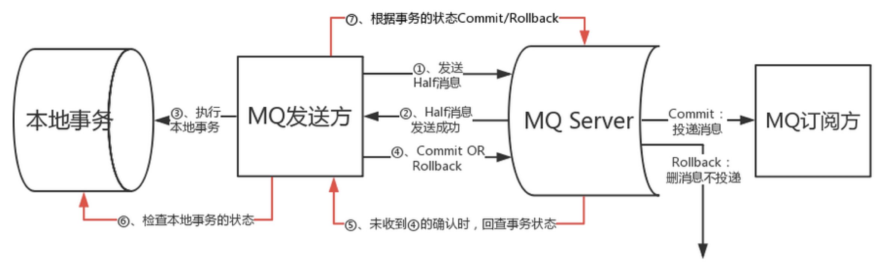

## RocketMq事务消息

这个其实就是数据库事务与MQ消息的一致性问题，简单来讲，数据库的事务跟普通MQ消息发送无法直接绑定与数据库事务绑定在一起

两阶段提交理论

https://www.jianshu.com/p/cc5c10221aa1

https://www.cnblogs.com/huangying2124/p/11702761.html

https://cloud.tencent.com/developer/article/1521583