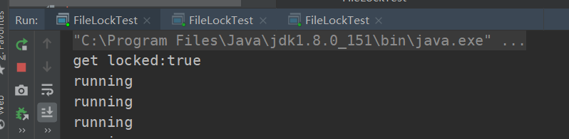
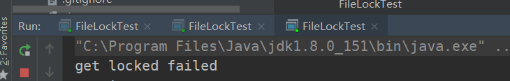

## RocketMq源码知识点学习

### RandomAccessFile 和 FileLock

在看store源码时，DefaultMessageStore中定义了一个FileLock属性

```
private RandomAccessFile lockFile;
private FileLock lock;
```

以前没有用过。学习一下

这两个属性用在start方法中，用来对一个文件或文件夹加锁。

```
public void start() throws Exception {

    lock = lockFile.getChannel().tryLock(0, 1, false);
    if (lock == null || lock.isShared() || !lock.isValid()) {
        throw new RuntimeException("Lock failed,MQ already started");
    }

    lockFile.getChannel().write(ByteBuffer.wrap("lock".getBytes()));
    lockFile.getChannel().force(true);
```

RandomAccessFile还比较常用，但是一般用来读写文件，因为可以指定位置的读写所以比较方便。

而这里是通过对文件进行加锁，保证只有一个store在启动。

哪个文件呢？在前面的代码中可以找到，就是store存储目录

```
File file = new File(StorePathConfigHelper.getLockFile(messageStoreConfig.getStorePathRootDir()));
MappedFile.ensureDirOK(file.getParent());
lockFile = new RandomAccessFile(file, "rw");
```

我们重点要学一下tryLock方法。

看注释说明，tryLock的特点是非阻塞的，尝试获取文件锁会立即返回。

获得的FileLock是进程级别的，不是线程级别的。换句话说文件锁可以解决多个进程并发访问、修改同一个文件的问题，但不能解决多线程并发访问、修改同一文件的问题。就是说同一进程内（同一个JVM）的多个线程，可以同时访问、修改此文件。但是其他JVM不可以。

文件锁是当前程序所属的JVM实例持有的，一旦获取到文件锁（对文件加锁），要调用release()，或者关闭对应的FileChannel对象，或者当前JVM退出，才会释放这个锁。

代码验证：

```
public class FileLockTest {
    public static void main(String[] args) throws IOException {
        File file = new File("D:\\tmp\\lock.txt");
        RandomAccessFile lockFile = new RandomAccessFile(file, "rw");

        FileLock lock = lockFile.getChannel().tryLock(0, 1, false);
        if (lock == null || lock.isShared() || !lock.isValid()) {
            System.out.println("get locked failed");
        } else {
            System.out.println("get locked:" + lock.isValid());
        }

        Executors.newSingleThreadScheduledExecutor().scheduleAtFixedRate(() -> {
            System.out.println("running");
        }, 10, 60, TimeUnit.SECONDS);
    }
}
```

启动第一个JVM获得锁，但是后面启动的获取文件锁失败。





这还是挺神奇的，怎么做到的？

依赖于底层操作系统，是由操作系统底层来实现的（如在 Win 的进程间不能同时读写一个文件，而在 Linux 的不同进程可以同时读写一个文件，称为询问式文件锁，所以要求程序按照规范判断文件是否加锁。）

文件锁分为2类：

- 排它锁：又叫独占锁。对文件加排它锁后，该进程可以对此文件进行读写，该进程独占此文件，其他进程不能读写此文件，直到该进程释放文件锁。
- 共享锁：某个进程对文件加共享锁，其他进程也可以访问此文件，但这些进程都只能读此文件，不能写。线程是安全的。只要还有一个进程持有共享锁，此文件就只能读，不能写。

有4种获取文件锁的方法：

- lock()  //对整个文件加锁，默认为排它锁。
- lock(long position, long size, booean shared)  //自定义加锁方式。前2个参数指定要加锁的部分（可以只对此文件的部分内容加锁），第三个参数值指定是否是共享锁。
- tryLock()  //对整个文件加锁，默认为排它锁。
- tryLock(long position, long size, booean shared)   //自定义加锁方式。

如果指定为共享锁，则其它进程可读此文件，所有进程均不能写此文件，如果某进程试图对此文件进行写操作，会抛出异常。

 

lock与tryLock的区别：

- lock是阻塞式的，如果未获取到文件锁，会一直阻塞当前线程，直到获取文件锁
- tryLock和lock的作用相同，只不过tryLock是非阻塞式的，tryLock是尝试获取文件锁，获取成功就返回锁对象，否则返回null，不会阻塞当前线程。


### 自旋锁与可重入锁

在RocketMq的broker落盘消息的store代码中，想文件中落盘数据之前加了锁。默认是使用自旋锁。

```
putMessageLock.lock(); //spin or ReentrantLock ,depending on store config
```

那么，在mq这种超高并发的情况下，怎么保证线程安全且兼顾效率？

#### spinlock自旋锁

为什么叫自旋锁呢？

是因为这种获取锁的方式是当一个线程在获取锁时，如果锁已经被其它线程获取，那么该线程将循环等待，然后不断的判断锁是否能够被成功获取，直到获取到锁。就像不断的在门口转圈，查看锁开了没。

好处是节省有上下文的切换。坏处是，如果竞争过多，会空耗cpu。

非自旋锁在获取不到锁的时候会进入阻塞状态，从而进入内核态，当获取到锁的时候需要从内核态恢复，需要线程上下文切换。 （线程被阻塞后便进入内核态，这样导致系统在用户态与内核态之间来回切换，会影响锁的性能）

可以这样理解，内核态相当于一个休息室，非自旋锁发现锁着，就到休息室去了，一会再从休息室过来。自旋锁就一直在门口转悠。

rocketmq中自旋锁的实现，可以拿来参考

```
public class PutMessageSpinLock {
    //true: 可以获取锁, false : 已经被锁住了.
    private AtomicBoolean putMessageSpinLock = new AtomicBoolean(true);

    @Override
    public void lock() {
        boolean flag;
        do {
            flag = this.putMessageSpinLock.compareAndSet(true, false);
        }
        while (!flag);
    }

    @Override
    public void unlock() {
        this.putMessageSpinLock.compareAndSet(false, true);
    }
}
```

原理就是不断的尝试compareAndSet，直到set成功。

可以看出这个实现是不可重入的。

#### ReentrantLock可重入锁

rocketmq直接使用jdk提供的ReentrantLock

ReentrantLock可以根据构造参数选择是公平锁还是非公平锁。非公平锁的优点在于吞吐量比公平锁大。

RocketMq使用的是非公平锁。


### CopyOnWriteArrayList

RocketMq在存储MappedFile时，用到了CopyOnWriteArrayList

```
private final CopyOnWriteArrayList<MappedFile> mappedFiles = new CopyOnWriteArrayList<MappedFile>();
```

在多线程编程中经常会用到CopyOnWriteArrayList