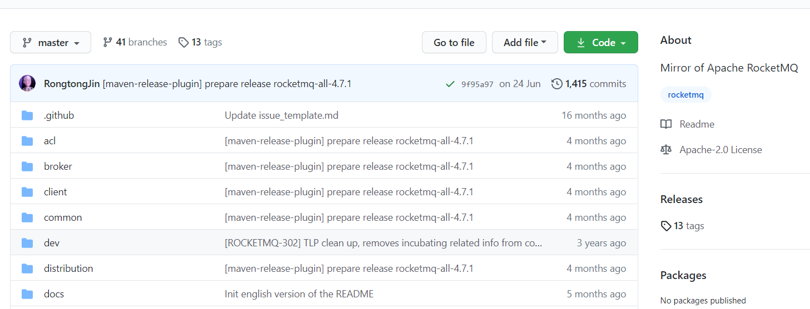
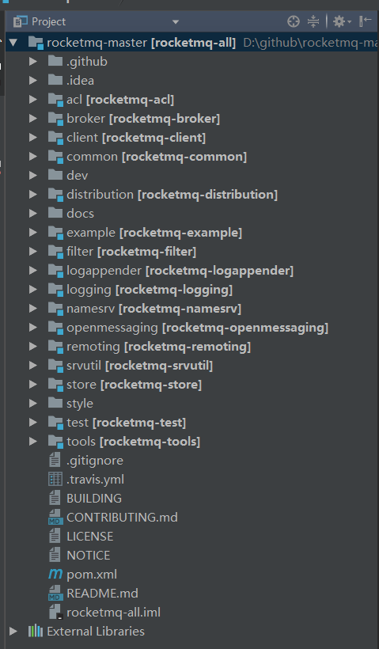
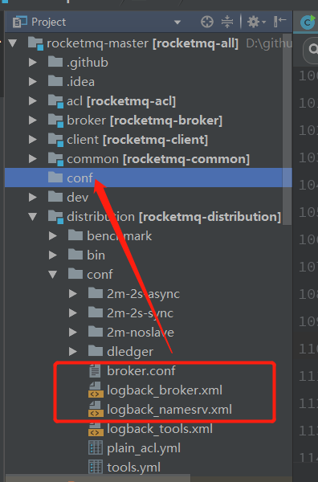
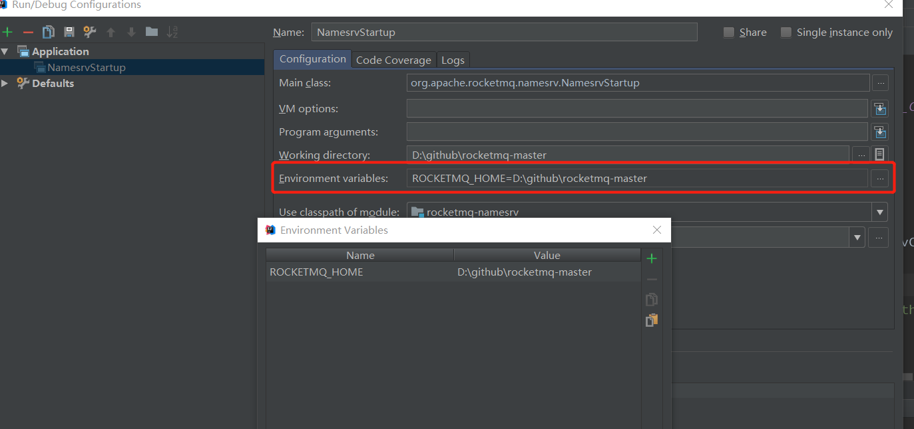
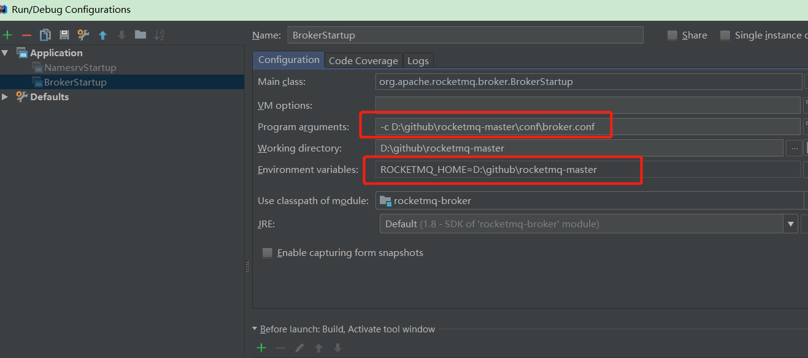
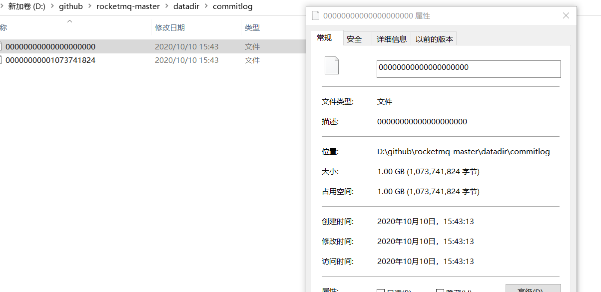

## RocketMq源码解析（一）

### 源码下载

从github官网下载https://github.com/apache/rocketmq



我这里下载的是当前最新代码，4.7.1的版本

导入idea



各个代码包的功能

- acl：权限控制模块

* broker: broker 模块（broke 启动进程） 
* client ：消息客户端，包含消息生产者、消息消费者相关类 
* common ：公共包 
* dev ：开发者信息（非源代码） 
* distribution ：部署实例文件夹（非源代码） 
* docs：很多官方文档。虽然不是源码，但很重要。强烈建议通读一遍。
* example: RocketMQ 例代码 
* filter ：消息过滤相关基础类
* logappender：日志实现相关类
* namesrv：NameServer实现相关类（NameServer启动进程）
* openmessageing：消息开放标准
* remoting：远程通信模块，基于Netty。
* srcutil：服务工具类
* store：消息存储实现相关类
* style：checkstyle相关实现
* test：测试相关类
* tools：工具类，监控命令相关实现类

### 启动测试环境

#### 编译打包

```
mvn clean package -Dmaven.test.skip=true
```

#### 启动NameSrv

先启动nameSrv

先建一个conf目录，存放需要的配置文件。



将`distribution`目录中的`broker.conf`和`logback_broker.xml`和`logback_namesrv.xml`复制过去一份

再配置一下Rocketmq_home环境参数，用来找到配置文件



启动

成功会打印

```
The Name Server boot success. serializeType=JSON
```

详细的日志，可以去日志文件中看。在logback的配置文件中可以找到。


#### 启动Broker

修改conf文件

```
brokerClusterName = DefaultCluster
brokerName = broker-a
brokerId = 0
deleteWhen = 04
fileReservedTime = 48
brokerRole = ASYNC_MASTER
flushDiskType = ASYNC_FLUSH

# namesrvAddr地址
namesrvAddr=127.0.0.1:9876
# 自动创建topic，方便测试
autoCreateTopicEnable=true
# 存储路径
storePathRootDir=D:\\github\\rocketmq-master\\dataDir
# commitLog路径
storePathCommitLog=D:\\github\\rocketmq-master\\dataDir\\commitlog
```

配置启动参数



注意，要配置一个-c参数，执行broker的配置文件

启动成功

```
The broker[broker-a, x.x.x.x:10911] boot success. serializeType=JSON and name server is 127.0.0.1:9876
```

#### 发送消息

在org.apache.rocketmq.example.quickstart包下，有最简单的测试代码

```
        DefaultMQProducer producer = new DefaultMQProducer("my_produce_group_name");
        producer.setNamesrvAddr("127.0.0.1:9876");
```

执行main方法，可以看到消息发送成功的日志

查看datadir目录，看到已经生成了很多文件。最重要的就是commitlog和consumequeue

commitlog下的文件，直接就是占1G空间的文件。



#### 消费消息

```
DefaultMQPushConsumer consumer = new DefaultMQPushConsumer("my_consume_group_name");
consumer.setNamesrvAddr("name-server1-ip:9876;name-server2-ip:9876")
```

允许main方法，可以看到消息消息掉了。

