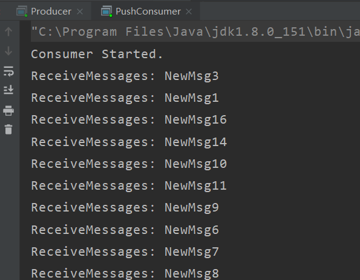
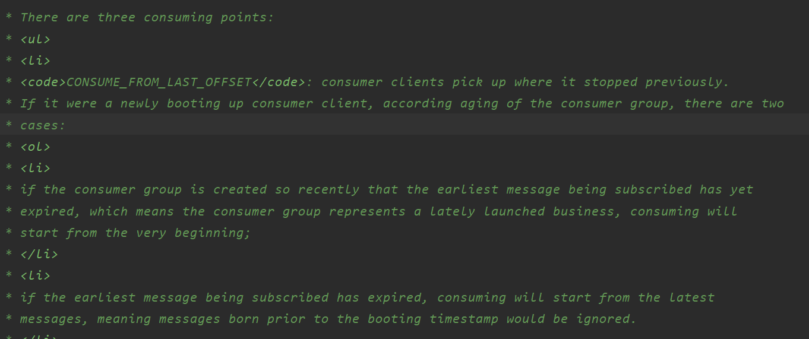

## 消费者启动后究竟从哪里开始消费消息

### 问题：

一个新的消费组订阅一个已存在的topic，是从哪一条消息开始消费呢？

（注意是新的消费组，消费组重启这不是新的消费组）

### 代码验证

我们知道在消费时，可以设置一个字段ConsumeFromWhere，从哪开始消费。可选参数，去掉Deprecated的，剩下的就是

```
public enum ConsumeFromWhere {
    CONSUME_FROM_LAST_OFFSET,
    CONSUME_FROM_FIRST_OFFSET,
    CONSUME_FROM_TIMESTAMP,
}
```

CONSUME_FROM_LAST_OFFSET：从最后的偏移量开始消费，

CONSUME_FROM_FIRST_OFFSET：从最小偏移量开始消费，

CONSUME_FROM_TIMESTAMP：从某个时间开始消费。

貌似看起来，CONSUME_FROM_LAST_OFFSET就是说会从消费者启动后，开始消费发送给broker的消息。

真的是这样吗？写个简单代码验证下

#### 先发送消息

```
public class Producer {
    public static void main(String[] args) throws MQClientException, InterruptedException {

        DefaultMQProducer producer = new DefaultMQProducer("ProducerGroupName");
        producer.setNamesrvAddr("127.0.0.1:9876");
        producer.start();

        for (int i = 0; i < 128; i++) {
           try {
                Message msg = new Message("TopicTest",
                        ("NewMsg" + i).getBytes(RemotingHelper.DEFAULT_CHARSET));
                SendResult sendResult = producer.send(msg);
                System.out.printf("%s%n", sendResult);
                Thread.sleep(1000);
            } catch (Exception e) {
                e.printStackTrace();
            }
        }
        producer.shutdown();
    }
}
```

模拟的场景是，topic一直存在。我们现在是有新的业务接入。

#### 启动消费者

```
public class PushConsumer {
    public static void main(String[] args) throws MQClientException {
        DefaultMQPushConsumer consumer = new DefaultMQPushConsumer("FromWhereConsumerGroup");
        consumer.setNamesrvAddr("127.0.0.1:9876");
        consumer.subscribe("TopicTest", "*");
        consumer.setConsumeFromWhere(ConsumeFromWhere.CONSUME_FROM_LAST_OFFSET);
        consumer.registerMessageListener(new MessageListenerConcurrently() {
            @Override
            public ConsumeConcurrentlyStatus consumeMessage(List<MessageExt> msgs, ConsumeConcurrentlyContext context) {
                System.out.printf("ReceiveMessages: %s%n", new String(msgs.get(0).getBody()));

                return ConsumeConcurrentlyStatus.CONSUME_SUCCESS;
            }
        });
        consumer.start();
        System.out.printf("Consumer Started.%n");
    }
}
```

发现直接是从第一条消息开始的。



这就很尴尬了，明明设置了CONSUME_FROM_LAST_OFFSET，为什么还是从第一条开始消费呢?

### 原因

先说原因，原因其实也简单。其实在ConsumeFromWhere的源码注释中已经写了。



CONSUME_FROM_LAST_OFFSET是从改消费者上次消费到的位置开始消费。

但是，如果是一个新的消费者。就要根据这个client所属的消费组的情况来判断。

如果所属的消费者组是新上线的，订阅的消息，最早的消息都没有过期。rocketmq的设计者认为，你这是一个新上线的业务，会强制从第一条消息开始消费。

相反,如果订阅的消息，已经产生了过期消息。那么才会从我们这个client启动的时间点开始消费。

所以说，ConsumeFromWhere这个参数只对一个新的消费者第一次启动时有效。

就是说，如果是一个消费者重启，他只会从自己上次消费到的offset，继续消费。这个参数是没用的。

这里最关键的是什么叫一个新的消费者？

### 如何判断新的消费者

先说一下，对于cluster消费模式，

消费者消费到哪的记录是在broker上的。是在数据目录下的config/consumerFilter.json文件

```
{
	"offsetTable":{
		"%RETRY%FromWhereConsumerGroup@FromWhereConsumerGroup":{0:0
		},
		"TopicTest@FromWhereConsumerGroup":{0:32,1:32,2:32,3:32
		}
	}
}
```

可以看出，broker记录消费位点是 topic名字+消费者组+队列

如上，现在是队列1消费到32等等

那么，当我们启动一个新的消费者时，broker首先回到这个文件中查询。如果找到，broker把这个消费位点返回给client，作为client第一次拉取消息的参数。

如果没找到，那么就是上面的逻辑了。

所以，最后强调一下。如果你的消费者组以前监听多某个topic，setConsumeFromWhere这个参数不管你设置什么都是不起效的。只要broker找的到消费位点，就是按照broker的来。就是这么霸道。

### 源码分析

org.apache.rocketmq.broker.processor.ConsumerManageProcessor#queryConsumerOffset

```
private RemotingCommand queryConsumerOffset(ChannelHandlerContext ctx, RemotingCommand request)
    throws RemotingCommandException {
    final RemotingCommand response =
        RemotingCommand.createResponseCommand(QueryConsumerOffsetResponseHeader.class);
    final QueryConsumerOffsetResponseHeader responseHeader =
        (QueryConsumerOffsetResponseHeader) response.readCustomHeader();
    final QueryConsumerOffsetRequestHeader requestHeader =
        (QueryConsumerOffsetRequestHeader) request
            .decodeCommandCustomHeader(QueryConsumerOffsetRequestHeader.class);

	// 用topic+consumergroup+queueId去查
    long offset =
        this.brokerController.getConsumerOffsetManager().queryOffset(
            requestHeader.getConsumerGroup(), requestHeader.getTopic(), requestHeader.getQueueId());

	// 如果查到了，且大于-1。就是在broker这边找到了。返回，按照broker的来
    if (offset >= 0) {
        responseHeader.setOffset(offset);
        response.setCode(ResponseCode.SUCCESS);
        response.setRemark(null);
    } else {
    	// 没找到，看看现在消息的最小offset
        long minOffset =
            this.brokerController.getMessageStore().getMinOffsetInQueue(requestHeader.getTopic(),
                requestHeader.getQueueId());
        if (minOffset <= 0
            && !this.brokerController.getMessageStore().checkInDiskByConsumeOffset(
            // 如果topic的消息最小偏移量还是0，并且最早的这条消息也存于内存中。那么强制从最早的消息开始消费
            requestHeader.getTopic(), requestHeader.getQueueId(), 0)) {
            responseHeader.setOffset(0L);
            response.setCode(ResponseCode.SUCCESS);
            response.setRemark(null);
        } else {
            // 这个就是说最早的消息已经过期了。才能按照客户端设置的ConsumeFromWhere策略来消费
            response.setCode(ResponseCode.QUERY_NOT_FOUND);
            response.setRemark("Not found, V3_0_6_SNAPSHOT maybe this group consumer boot first");
        }
    }

    return response;
}
```

checkInDiskByConsumeOffset这个方法的作用。查看这个消息是否不在内存中了。

```
/**
 * Check if the given message has been swapped out of the memory.
 *
 * @param topic topic.
 * @param queueId queue ID.
 * @param consumeOffset consume queue offset.
 * @return true if the message is no longer in memory; false otherwise.
 */
boolean checkInDiskByConsumeOffset(final String topic, final int queueId, long consumeOffset);
```