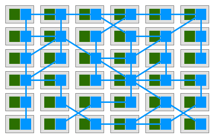
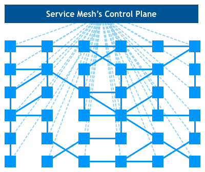

## Service Mesh概念入门

Service Mesh译为服务网格，是微服务的升级进化。那么为什么会出现Service Mesh？就应该先分析当前以SpringCloud为代表的微服务框架有什么问题？个人认为有以下三点：

- 框架服务。比如使用SpringCloud，需要对SC多个组件有充分的了解。同时需要有能力排查SC组件中的问题。
- 微服务框架通常仅支持一种或特定的集中框架。然鹅，这和当初微服务定义的一个重要特性：语言无关性。显然是背道而驰的。
- 在代码层面。微服务框架和业务代码强耦合在一起。框架的版本设计，依赖库的升级替换等，会对业务代码产生直接的影响。

所以出现了以Linkerd，Envoy，Ngixmesh为代表的代理模式（边车模式）应运而生。

啥是边车？就这个

很形象，对应到软件设计中，就是边车设计模式。个人认为和代理模式一样。

所谓边车模式，意为在业务代码之外，单独部署一个实现了负载均衡、服务发现、认证授权、监控追踪、流量控制等分布式系统所需要的功能的模块，作为一个和服务对等的代理服务，和业务服务部署在一起，接管服务的流量。由这个边车来控制微服务之间的发现调用和监控管理的功能。

站在一个更高的视角，当服务非常多时，便是下面这样的一个服务网格。绿色节点表示业务服务，蓝色为对应的边车。

这就是第一代Service Mesh。

这个网格看起来错综复杂，运维困难。所以继续优化，出现了以以Istio为代表的第二代Service Mesh。

每个边车服务都会将自己的信息注册到控制台。控制台可以全局监控服务，对某个服务下发控制命令。

鸟瞰图

服务依然在网格间不断穿梭，我们从统一的控制台掌控全局。

再来一张功能架构图

Service Mesh对我打动最深的是两点，

1，语言无关性。我们可以根据业务和开放人员能力特点选择合适的开发语言。并且各个小组之间可以根据情况自行选择。

2，框架代码和业务代码的分离。因为大量的微服务底层的功能由边车代理模块提供。所以业务代码可以更简单，甚至于从复杂的SpringCloud中退回到SpringBoot。再加上服务容器化。将来可能业务开发人员和ServiceMesh开发运维人员会更加的泾渭分明。

个人看法，以Spring Cloud为代表的微服务是实现服务治理平台的现状，而Service Mesh却是未来。

参考链接

https://philcalcado.com/2017/08/03/pattern_service_mesh.html

https://www.nginx.com/blog/what-is-a-service-mesh/

