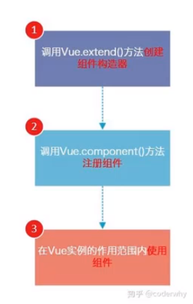
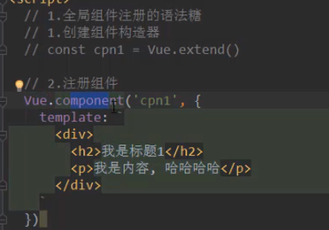
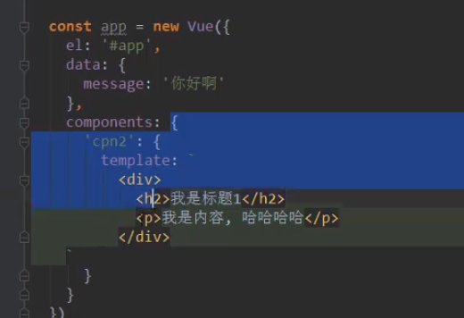
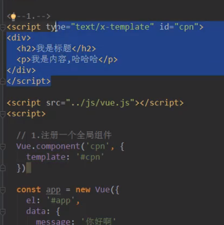
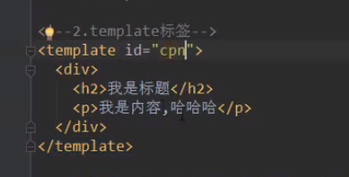
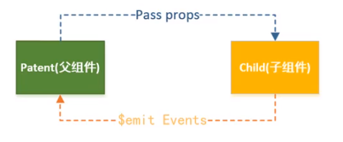
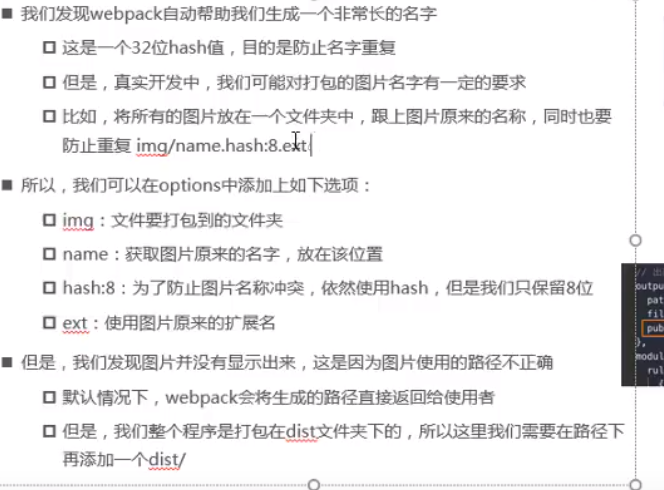
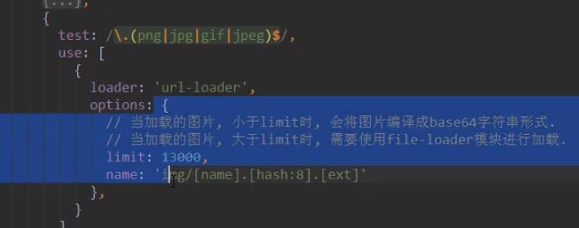
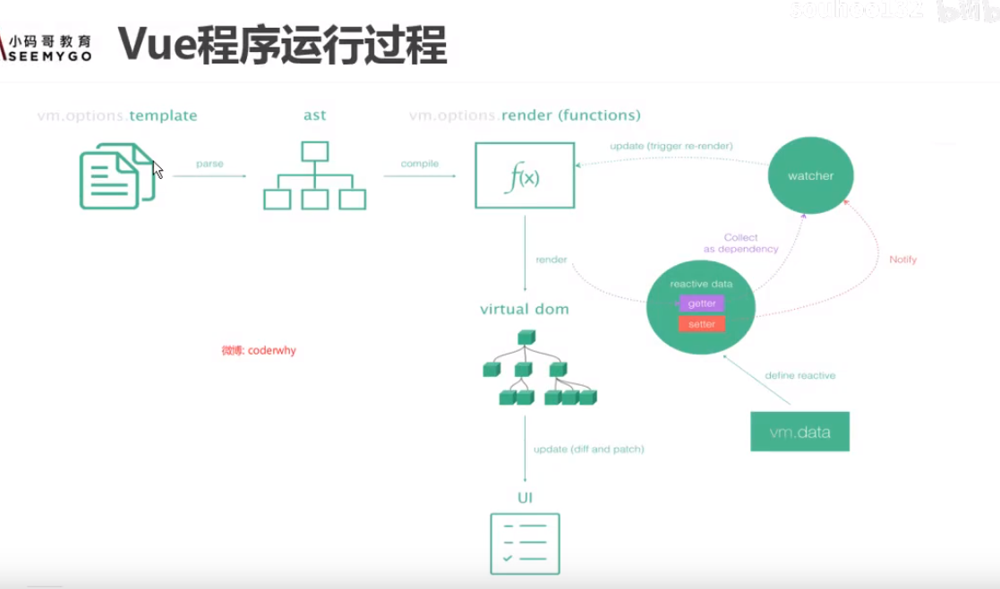

### 基础知识

#### 计算属性：

在{{}}使用时不用加（）。他的本质是属性

原理：get set。省略set，再简写get，就变成我们一般的function写法

computed和methods区别：

computed调用多次，实际只计算了一次。有缓存机制

#### es6

es5中的var没有if/for等的变量作用域。es5只有function才有作用域

es6的let是有块级作用域了

const是指向的内存地址不能变，但是对象的具体属性可以变

增强写法

对象的增强写法

函数的增强写法

使用``定义字符串，可以换行

##### 箭头函数

箭头函数中的this，是向外层一层层的找，找到的第一个this就是

而function写法中的this，就是window

#### v-bind绑定

可以动态绑定 style


#### v-on 事件监听

语法糖 @

传参问题：不传参时，（）可以省略

如果函数需要参数，而你又把（）省略了，那么会把事件event传过去

如果函数需要一个event对象，html中可以使用$event获取浏览器的事件

v-on传参时，如果不加单引号的是变量

#### v-on的修饰符

.stop 阻止冒泡  如 @click.stop=“onClick”

.prevent 阻止默认事件  如form中的提交按钮有默认的表单提交

.{keyCode|keyAlias} 监听指定按键的点击，

如@keyup 监听所有按键抬起

@keyup.enter 只监听回车

.once 只触发一次

#### v-if v-else-if v-else

不用加{{}}

如果是切换输入框，默认已经输入的值是不会清除的。

原因是vue的底层处理，虚拟dom。处于性能考虑，会尽可能的复用已经存在的元素。所以input会被复用，输入的值会传递过去。

如果想打破这种复用，可以给元素加上一个key属性

#### v-show

和v-if的区别是，v-if的元素是元素直接没有，v-show是display：none，所以从效率上说v-show更高效

#### v-for

in

在遍历对象的过程中，如果只取一个值，那么取到的是value

用（value, key）的格式可以获取key

##### 哪些list方法是响应式的？

push（在最后面追加，可以一次加多个），pop（删除最后一个），shift（删除第一个），unshift(在最前面加元素，可以一次加多个)，splice（删除，插入或替换元素。从第几个元素开始，删除几个元素，再在当前位置加几个元素），sort，reverse

通过索引值修改list的某个元素，不是响应式的，页面不会修改！！！因为vue内部没有监听这个。这种需求可以使用上面的那些方法，或者使用Vue.set()方法

#### 过滤器

在Vue中定义 

```
filters：{

	方法名（param）： {

	}

}
```


使用 {{ parameter | 过滤器名}}


#### js 高级函数

for-in   index

for-of  item

filter:过滤。函数必须返回布尔值

map:

reduce:对list进行汇总。

```
list.reduce(function(上一次汇总的值，这一次的值){
	函数处理
},0:第一次的初始化值)
```

递归操作


#### v-modal 双向绑定

表单绑定。如input的绑定

原理可以看成是v-bind和v-on的组合使用。函数传递event

值绑定的概念，值不一定是写死的。可以动态绑定v-bind

##### v-modal的修饰符

1. lazy

   不要实时双向绑定。加lazy后，可以在input失去焦点时绑定

2. number

   默认v-modal绑定的类型都是String类型

   使用number限制为数字类型

3. trim

   去除空格

### 组件化

#### 使用组件的三个步骤

1. 创建组件构造器

   参数：template

2. 注册组件

   参数：组件名，上面的组件构造器

3. 使用组件

   <组件名></组件名>



这种写法在vue2.*基本不会使用了，2.x版本提供了更好用的语法糖，但是这是基础。

#### 语法糖注册组件



不需要使用Vue.extend了

局部组件也一样



#### 模板代码抽离

上面还是在js里写了html代码，很乱。

第一种写法，注意type



第二种写法，template标签。这个好



#### 全局组件和局部组件

在全局的<script>标签下写

```
Vue.component()注册的就是全局组件
```

全局组件意味着可以在多个vue实例中使用

局部组件：到某个具体的vue实例下注册

```
components: {
在这注册
}
```

#### 父组件和子组件

可以在组件构造器中，使用components注册其他的组件。这样就形成了父子关系。

#### 组件不能直接访问vue实例中的data

component有自己的data，而且这个data需要是一个function，且return数据

组件也有自己的methods

##### 为什么data必须是一个函数

因为一个页面里可能使用多次这个组件，如果data是一个对象，那么多个组件就共用了一个对象，所以必须使用函数，每个组件创建自己的data

#### 父子组件的消息传递



props：父组件向子组件传递数据

event：子组件向父组件传递事件


#### 父子组件互相访问

在父组件中直接拿到子组件，然后调用他的方法,获取他的数据

##### 父访问子：

$children（用的很少，用下标值定位不方便），$refs  一般用这个。在组件使用时加ref="aaa"

this.$refs.aaa.    

##### 子访问父:

首先这种用法就不建议。$parent

和父组件的耦合度太高

#### 解决：dialog中强制对子组件进行初始化

问题: 因为父组件是个dialog, 导致子组件一直存在, 没有刷新. 所以当父组件传值更新时, 子组件无法获取到.

解决: 只要让子组件强制刷新就可以获取到props传递过来的值了. 利用v-if的特性, 在父组件中强制刷新子组件. 

```
<Son v-if="sonRefresh"></Son>

data(){
　　return {
　　　　sonRefresh: true
　　}
}

// 下面这段内容写在父组件的dialog打开的时候
this.sonRefresh= false;
this.$nextTick(() => {
    this.sonRefresh= true;
});
```

以上内容都是写在父组件中的.

##### 访问根组件

$root 直接访问到最外层的vue实例

#### watch方法

监听数据的改变，必须同名


#### 插槽solt

组件的插槽是为了让组件更加有扩展性

<slot>可以有默认值

##### 具名插槽

一个组件中有多个插槽，需要指定某个插槽显示什么内容。加上name。

使用时 v-slot指定名字

##### 作用域插槽

父组件来替换掉插槽的标签，子组件来决定内容

slot-scope

### 模块化开发

#### CommonJS规范

webpack使用，node使用

export/require

#### ES6的模块化规范

export/import

export default ：我们不希望给导出的方法起名，让引入的代码自己起名。所以，detault导出的只能有一个

import * 全部导入的语法

#### webpack

##### 是什么

本质上说，是一个js应用的静态模块打包工具。关键词时模块和打包

处理模块依赖关系，整合打包

区别： grunt（现在没人用了）/gulp 核心是任务，任务流

##### webpack安装

webpack依赖node环境，先安装node

##### loader

webpack本身只能处理js的依赖打包，对于css需要使用loader

loader就是用来扩展webpack的打包能力

比如解析css，需要使用css的loader。去查webpack官网。

加载文件 url-loader   limit限制大小。小于limit的使用url-loader,并且转换为base64格式使用。

大于limit的使用file-loader





使用vue

##### plugin

webpack的扩展插件


### vue程序运行过程



ast：抽象语法树

runtime-only 可以看出是编译时，处理掉template

runtime-compiler 是在运行时处理template


### vue-router

hash模式和history模式

<router-link>

<router-view>

代码中 this.$router

vue-router会给每个this自动加上$router

还有一个 $route，这是当前活跃的路由

keep-alive的使用

### 路径别名

可以给路径配置别名

注意，在html标签中使用别名时，要加~

在js中import时不需要


### Promise

es6新引入的。用来进行异步编程。

```
new Promise((resolve, reject) => {
	....
	resolve(data)
}).then((data) => {

})
```

resolve函数就是then里的函数

就是说，由异步操作，就用Promise包起来处理。

### vuex

统一状态管理

文件夹名为store

vue下的内容一般是固定的

state：存储状态数据。单一状态树（单一状态源）

mutations: 操作state中的数据必须通过mutations。这样vue的devtools才能跟踪到。这里面写操作state的方法。使用 this.$store.commit('mutations里定义的方法')

action：在有异步操作的情况下使用，this.$store.dispatch(actions里定义的方法')。可以在action里返回一个promise，在外面用then接住

getters：和计算属性有点像。$store.getters.你写的getter方法

module：划分模块


#### vue强制加入响应式

后来加入的属性是没有响应式的，要用Vue.set强制加入响应式

同理，删除对象的一个属性也不是响应式的，要用Vue.delete就是响应式的