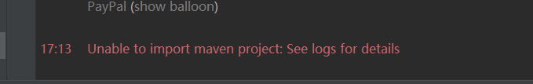
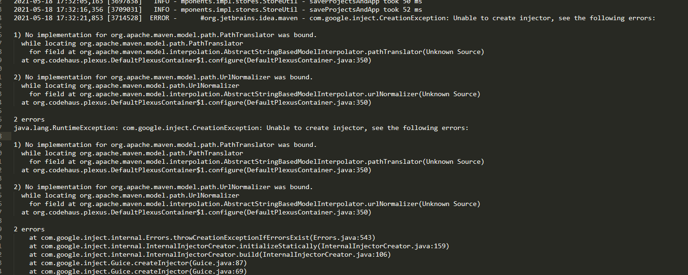

## idea与maven版本匹配问题

新换了电脑，重新安装了开发环境，然后idea引入以前的maven项目，结果在idea里编译项目报错

>  Unable to import maven project: See logs for details

检查了各处配置，均没有问题。必须去看看这个错误日志了。

### 去哪看这个详细日志

Help-->show log in explorer

### 原因&解决：

我的idea是2019版本，然后我本地装了maven最新版3.8.1.两者有兼容性问题。

换回之前用的3.5.4版本。好了。