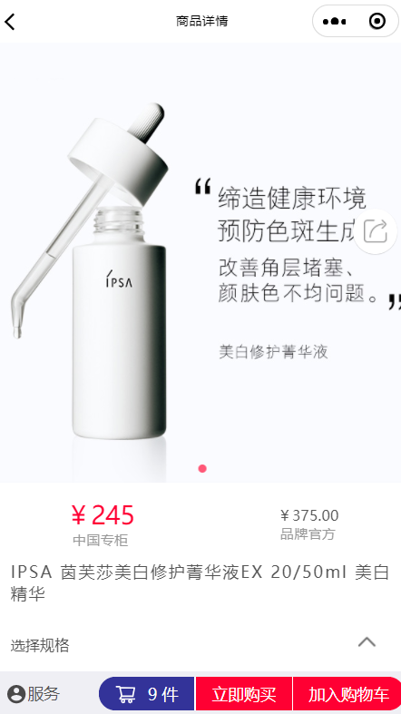

## 小程序Swipper组件自适应图片高度

### 问题：

Swipper组件默认最小高度是150px，如果图片比较大，超过的部分不会显示。如果把swipper的高度设置的比较大，又会导致小图片下面有一块空白部分，看着很丑。所以，需要做到根据图片的实际高度动态计算swipper组件的高度。

### 原理

图片加载完之后，获取图片的原始宽高，根据宽高比，计算出适应后的宽高，保存到一个数组中。在swipper切换时监听当前显示的图片，根据其索引找到对应的高度，并赋值给swipper组件。

### 代码

#### xml

```
<swiper indicator-dots='true' 
        indicator-active-color='#ff5777'
        autoplay='true'
        circular='true'
        interval='3000'
        bindchange="bindchange"
        style="height:{{imgheights[current]}}rpx;">
  <block wx:for="{{images}}" wx:key="index">
    <swiper-item>
      <image mode="widthFix" class="swiper-image" src="{{item}}" mode='widthFix' data-id='{{index}}' data-url='{{item}}'  bindlongtap="savePic" bindload="imageLoad"/>
    </swiper-item>
  </block>
</swiper>
```

#### js

```
// components/w-swiper/w-swiper.js
Component({
  /**
   * 组件的属性列表
   */
  properties: {
    images: {
      type: Array,
      value: []
    }
  },

  /**
   * 组件的初始数据
   */
  data: {
    //所有图片的高度  
    imgheights: [],
    //图片宽度 
    imgwidth: 750,
    //默认  
    current: 0
  },

  /**
   * 组件的方法列表
   */
  methods: {
    savePic(e) {
      const $this = this
      const imgUrl = e.currentTarget.dataset['url'];
      wx.showActionSheet({
        itemList: ['保存到手机'],
        success(res) {
          console.log(res.tapIndex)
          if (res.tapIndex === 0) {
            $this.saveImage(imgUrl)
          }
        },
        fail(res) {
          console.log(res.errMsg)
        }
      })
    },
    saveImage(imgUrl) {
      wx.showLoading({
        title: '保存中...',
        mask: true,
      });
      wx.downloadFile({
        url: imgUrl,
        success: function (res) {
          if (res.statusCode === 200) {
            let img = res.tempFilePath;
            wx.saveImageToPhotosAlbum({
              filePath: img,
              success(res) {
                wx.showToast({
                  title: '保存成功',
                  icon: 'success',
                  duration: 2000
                });
              },
              fail(res) {
                wx.showToast({
                  title: '保存失败',
                  icon: 'success',
                  duration: 2000
                });
              }
            });
          }
          wx.hideLoading()
        }
      });
    },
    imageLoad: function (e) { //获取图片真实宽度  
      var imgwidth = e.detail.width,
        imgheight = e.detail.height,
        //宽高比  
        ratio = imgwidth / imgheight;
      console.log(imgwidth, imgheight)
      //计算的高度值  
      var viewHeight = 750 / ratio;
      var imgheight = viewHeight;
      var imgheights = this.data.imgheights;
      //把每一张图片的对应的高度记录到数组里  
      imgheights[e.target.dataset.id] = imgheight;
      this.setData({
        imgheights: imgheights
      })
    },
    bindchange: function (e) {
      // console.log(e.detail.current)
      this.setData({
        current: e.detail.current
      })
    },
  }
})
```

#### css

```
.swiper-image {
  width: 100%;
  height: auto;
}
```

### 效果


