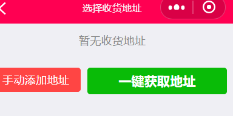
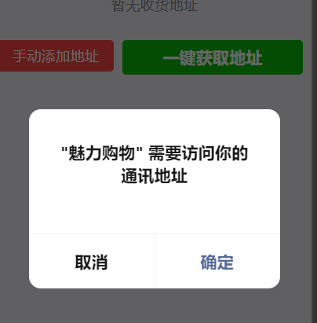
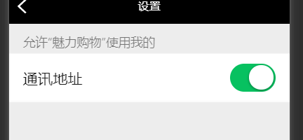
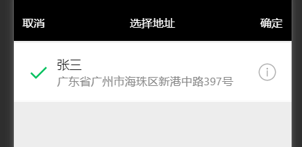

## 一键获取微信收货地址

在小程序中获取用户的收货地址，还是比较简单的。

下面总结下步骤：

页面：





点击确定，显示地址，再确定后，可以得到地址信息：

```
cityName: "广州市"
countyName: "海珠区"
detailInfo: "新港中路397号"
errMsg: "chooseAddress:ok"
nationalCode: "510000"
postalCode: "510000"
provinceName: "广东省"
telNumber: "020-81167888"
userName: "张三"
```

还是很简单的。但是，要注意：一旦这里点击了取消，以后再点击一键获取地址，不会再弹出这个授权界面


我们需要先判断，用户是否给了授权


先调用 wx.getSetting，

```
wx.getSetting({
            success: function(res) {
                console.log(res)
            },

        })
```

打印一下：

```
authSetting:
scope.address: false
__proto__: Object
errMsg: "getSetting:ok"
```

看到对收货地址的授权是false

所以，加上让用户重新授权的代码

```
// 有值，并且是false。打开授权页面，重新授权
                if (res.authSetting['scope.address'] == false) {
                    wx.openSetting({
                        success: function(res) {
                        console.log(res.authSetting)
                        }
                    })
                }
```





再次点击，就可以了

