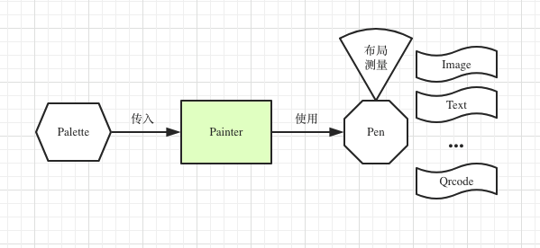
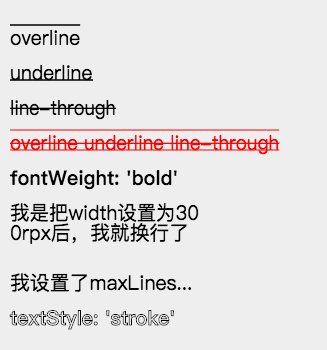
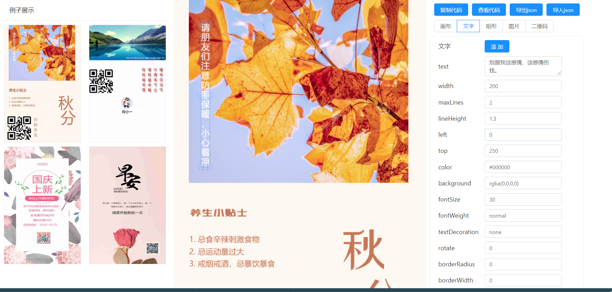
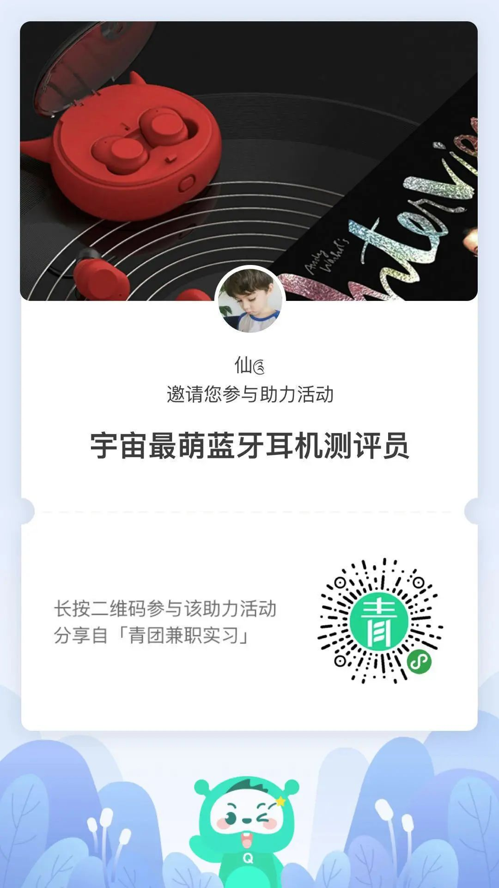

# 如何快速实现小程序海报分享图

在小程序的运营过程中，一个非常重要的手段就是分享海报，邀请注册。所以一张设计精美的有吸引力的海报是非常重要的。

有前后端两种方案。一种是后端生成分享图。但是这种很不好，一个是加大了后端服务器的压力，同时后端还需要存储，然后网络传输，都是资源的消耗。而且我在java下生成的图片，要解决锯齿等问题，一直没有找到很好的解决，有知道的朋友请不吝赐教。

另一个就是在小程序端生成。这就要使用小程序的canvas了。但是在使用中可能会遇到各种问题，主要是：

1，小程序中有大量的生成图片需求，但是使用过 canvas 的人，都会发现一些难以预料的问题

2，直接在 canvas 上绘制图形，对于普通开发者来说代码会特别凌乱并且难以维护，经常会花费很久的时间去优化代码

3，不同的环境渲染问题，例如在开发者工具看起来好好的，一到 Android 真机，就出现图片不显示，位置不对应等等问题

所以，

## 开源组件 painter

开源地址：https://github.com/Kujiale-Mobile/Painter

主要思路就是将我们要展示的信息，以json格式传给painter组件。由这个开源组件直接绘制出图片。



该组件已经对text实现了很多常用样式，像下划线，删除线，换行等等都有




## 进击--可视化编辑代码工具

是不是觉得自己写一堆json也很麻烦，那么就用下下面这个进击神器吧

https://lingxiaoyi.github.io/painter-custom-poster/

可视化代码编辑工具



这个网站给了几个例子，可以在这个基础上改，也可以新增编辑。都很方便。

在页面上做好图以后，直接复制json数据出来。放到代码里，再稍微调一调基本就能用。


怎么样，爽吧。


## 使用教程

### 1，引入

可以按照官方的说明，使用git的子模块模式，直接将painter添加到你的components文件夹下

```
git submodule add https://github.com/Kujiale-Mobile/PainterCore.git components/painter
```

这样做的好处是，你可以随时跟进版本的更新。

当然，也可以自己手动复制代码。

然后是需要画图的page使用自定义组件

```
"usingComponents":{
  "painter":"/components/painter/painter"
}
```

### 2，使用

在wxml中使用

```
<painter style="position: absolute; top: -9999rpx;" palette="{{imgDraw}}" bind:imgOK="onImgOK" />
```

palette接收绘图json格式数据。json数据就用可视化工具导出。

imgOK是绘图完成的回调函数，回调结果中的e.detail.path是生成的图片的临时路径



