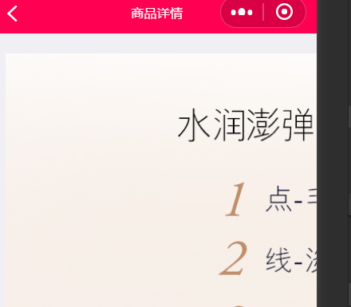
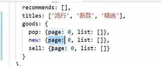
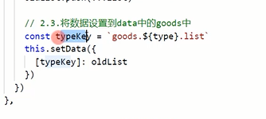
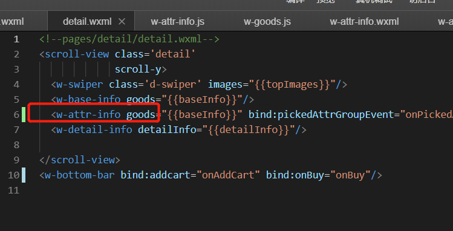
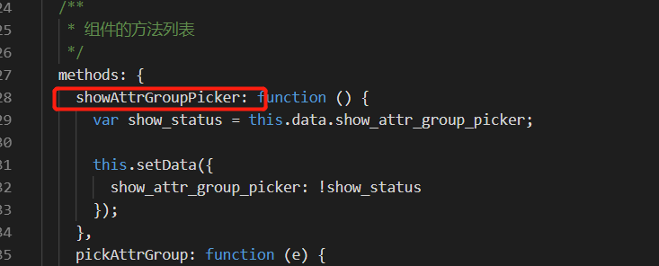
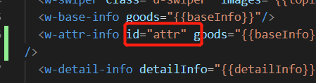
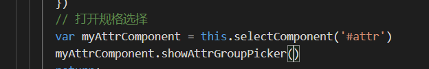

### 小坑

#### 1，图片

图片有默认的宽度是320px，有时候展示会不能占满屏幕。

fix:

将宽度设置为100%

并且mode一般使用widthFix


#### 2，rich-text 图片太大问题

wxml文件下  
```<view class="find-content">
    <rich-text nodes="{{content}}" type='text'></rich-text>
```

js文件下

``` 
     let content = res.content;
     //重点是这句话 res.content是从后台获取的数据 进行正则匹配的
     res.content = content.replace(/\标签下加了style="width:100%;height:auto"，但是如果原本img中就有style样式， 还是有问题。



所以对正则就行优化：

```
formatImg:function(html){
            var newContent= html.replace(/]*>/gi,function(match,capture){
            var match = match.replace(/style=\"(.*)\"/gi, '');
            return match;
        });
        return newContent;
    }
```

写了一个方法，把img标签中的style删除

然后再统一加上我们的样式。

```
newContent.replace(/\]*>/gi,function(match,capture){
      var match = match.replace(/style=\"(.*)\"/gi, '');
      return match;
      });
    const result = newContent.replace(/\
```


#### 4，复杂结构的data  set值






#### 5，在页面调用自定义组件中的方法



detail页面中引用了w-attr-info自定义组件

现在需要调用其



方法来控制显示

调用方法：

给自定义组件设置一个id



在js中取到这个组件，然后执行其方法即可




#### 6，自定义组件的样式

除继承样式外， `app.wxss` 中的样式、组件所在页面的的样式对自定义组件无效（除非更改组件样式隔离选项）。


#### 7，小程序调用微信支付

调用统一下单后，要对结果进行二次签名

一定要和微信的官方文档一个字段一个字段的对清楚，注意大小写

我因为appId和nonceStr不小心写成了小写，导致签名验证不过


#### 8，showModel遇到类型错误

```
        const msg = res.data
        wx.showModal({
          title: '抱歉',
          content: msg,
          confirmText: '我知道了',
          showCancel: false
        });
```

报错：

{"errMsg":"showModal:fail parameter error: parameter.content should be String instead of Undefined;"}
Object

因为content必须是String类型

改成：content: msg + "" 即可


#### 9，一个页面上两个scroll-view互相影响的问题

需要保持相互独立，互不影响。但是二级菜单滚动，一级菜单也一起滚动了。

解决：设置样式

具体的解决方法是对于左边的 **scroll-view** 的样式设置中，添加position属性，且设置为fixed；对于右边的 **scroll-view** 的样式设置中添加两个属性，一个是float，且属性值为right，另一个是margin-left，

```
.category w-menu {
  width: 30%;
  position: fixed;
}

.category brand-list {
  width: 70%;
  margin-left: 30%;
  float: right; 
}
```


#### 10，画分享图

使用微信原始的canvas坑太多了

https://developers.weixin.qq.com/community/develop/article/doc/000ac686c5c5506f18b87ee825b013

https://github.com/Kujiale-Mobile/Painter

在线编辑

https://lingxiaoyi.github.io/painter-custom-poster/


#### 11 vant-tabs 下面的选中条偏移

自定义样式

https://blog.csdn.net/HYeeee/article/details/82747874

没用上

解决：

看的官网 https://youzan.github.io/vant-weapp/#/custom-style

关于如何重置样式

其他文章资源

https://www.jianshu.com/p/b231ca8a9d3f

#### 12 复杂数据的赋值

https://www.jianshu.com/p/8487bb7521af

- 第一步：先用一个变量，把(info1.name)用字符串拼接起来。
- 第二步：将变量写在[]里面即可。

```cc
const _k1 = `info1.name` // 拼接已知属性
const _k2 = `info2[${index}].name` // 拼接动态属性
this.setData({
  [_k1]: 'cc',
  [_k2]: 'cc'
})
```


#### 13，顶部固顶的新属性

https://blog.csdn.net/baozhuona/article/details/80849000

可以 position: sticky;  不好使


#### 14，解决wx.getUserInfo不再弹框的问题

https://blog.csdn.net/xishuchen0520/article/details/80410861?utm_medium=distribute.pc_relevant_t0.none-task-blog-BlogCommendFromMachineLearnPai2-1.channel_param&depth_1-utm_source=distribute.pc_relevant_t0.none-task-blog-BlogCommendFromMachineLearnPai2-1.channel_param


#### 15， 动态控制多个class的写法

只要在花括号内做三元运算选择相应的class,他们之间用空格隔开就好

```
<view class="{{}}  {{}}  {{}}">hello world</view>
```


#### 16，vant组件阻止冒泡

vant组件的事件都是bind的，没有catch的。如果要阻止冒泡，需要自己写一个catchtap，全部阻止点击事件即可。

必须，弹出框中用了时间选择器。需要阻止时间选择器的事件向上冒泡。

```wxml
  <van-popup show="{{ calendar_show }}" bind:close="onClose" custom-class="pop">
    <van-datetime-picker type="date"  value="{{ currentDate }}" bind:confirm="onConfirm" bind:cancel="onClose" catch:tap="noop" min-date="{{ minDate }}" max-date="{{ maxDate }}" formatter="{{ formatter }}" />
  </van-popup>
```

```js
    noop() {
        console.log("阻止冒泡")
    }
```

#### 17，小程序button组件去除边框

在 button  的 plain="true",使用背景图片时.

小程序 默认在这个 css 样式中定义了 边框.

所以,设置这个 可以取消边框

button[plain] {

border:none;

}