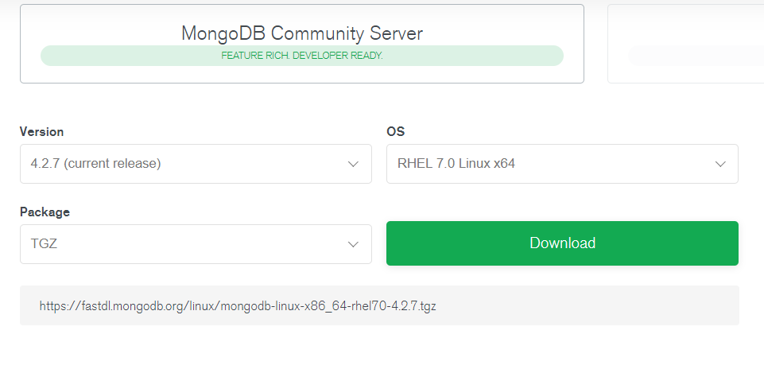
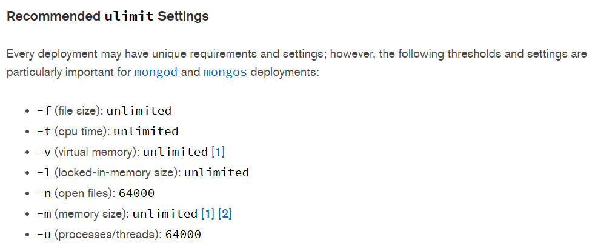

## MongoDB单机环境搭建

### 1，下载

去mongo的官网下载最新发行版，我安装的时候是4.2.7



### 2，规划

本次搭建的是单机环境，主要用于个人测试使用。


### 3，系统参数修改

官方建议的ulimit参数配置



#### 不使用hugepages

 cat /proc/sys/vm/nr_hugepages

确保其值为零，如果不是请修改执行下面操作。

 echo 0>/proc/sys/vm/nr_hugepages

echo never >> /sys/kernel/mm/transparent_hugepage/enabled

echo never >> /sys/kernel/mm/transparent_hugepage/defrag

#### 防火墙端口 

我这里规划使用11000端口，要提前打开。需root权限

firewall-cmd --zone=public --add-port=11000/tcp --permanent

firewall-cmd --reload

firewall-cmd --list-ports

#### 安装numactl

在NUMA架构的机器上，要以numactl运行，否则有告警

```
yum install numactl
```


### 4，开始部署

#### 4.1 目录规划

| ~/mongo                     | 放mongo安装文件 |
| --------------------------- | --------------- |
| ~/mongodata/data            | 放数据文件      |
| ~/mongodata/logs/mongod.log | mongo运行日志   |
|                             |                 |

#### 4.2 解压

``` cd  ~/mongo
cd ~/mongo
wget http://我自己的服务/U9gUl/mongodb-linux-x86_64-rhel70-4.2.7.tgz
tar -zxvf mongodb-linux-x86_64-rhel70-4.2.7.tgz
cd mongodb-linux-x86_64-rhel70-4.2.7
cd bin
```

#### 4.3 配置文件

当前所在路径为 mongo/mongodb-linux-x86_64-rhel70-4.2.7/bin

创建配置文件

```shell
mkdir conf
cd conf
vim mongod.conf
```

配置文件内容：

具体解释，可以看官方文档

https://docs.mongodb.com/manual/reference/configuration-options/#file-format

```
systemLog:
   destination: file
   path: "/home/xxx/mongodata/logs/mongod.log"  
   logAppend: true
storage:
   journal:
       enabled: true
   dbPath: "/home/xxx/mongodata/data"
   directoryPerDB: true
   engine: wiredTiger
   wiredTiger:
       engineConfig:
           cacheSizeGB: 1
           directoryForIndexes: true
           journalCompressor: zlib
       collectionConfig:
           blockCompressor: zlib
       indexConfig:
           prefixCompression: true
net:
	bindIp: 0.0.0.0
    port: 11000
processManagement:
    fork: true
```

#### 4.4 启动脚本

写个start.sh，以后方便点

```
numactl --interleave=all /home/haieradmin/mongo/mongodb-linux-x86_64-rhel70-4.2.7/bin/mongod -f ./conf/mongod.conf
```

``` 
chmod +x start.sh
```

#### 4.5 启动

```
sh start.sh
```


#### 4.6 关闭

```
./mongod --shutdown -f ./conf/mongod.conf
```


### 5 配置管理员用户

登录

```
./mongo localhost:11000
```

会看到有告警

> ** WARNING: Access control is not enabled for the database.

应该以认证的安全模式使用mongo。否则都能登录mongo。

先切到admin库下，默认是在test库。这点容易忘记

```
use admin
```

```
db.createUser({user: "admin", pwd: "Hello,123", roles:[{role:"root", db:"admin"}]})
```

现在用auth模式重启，解决warning

修改start.sh

```
numactl --interleave=all /home/haieradmin/mongo/mongodb-linux-x86_64-rhel70-4.2.7/bin/mongod --auth -f ./conf/mongod.conf
```

重启mongo。重新登录，要加上用户名密码

```
./mongo localhost:11000  -u admin -p Hello,123 --authenticationDatabase admin
```

### 6, 创建普通用户及业务数据库

记得切到admin库下

```
use admin
db.createUser({ user: 'baas', pwd: 'hibaas',roles: [ { role: "dbOwner", db: "baas_bbs" }] })
```

切到baas_bbs库下

插入一条数据试试

```
use baas_bbs
db.testCollection.save({"name":"yunsh","age":"18"})
```

> WriteResult({ "nInserted" : 1 })

ok,完成

