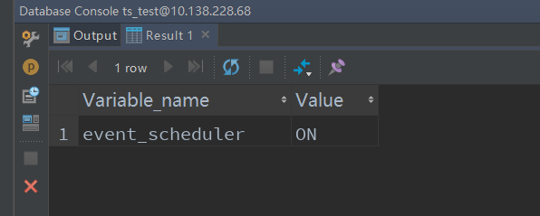
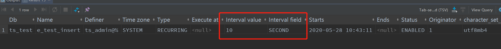
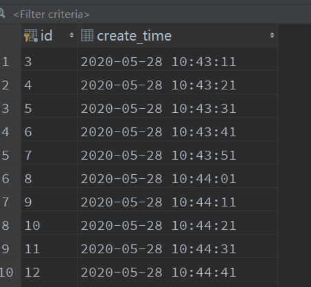
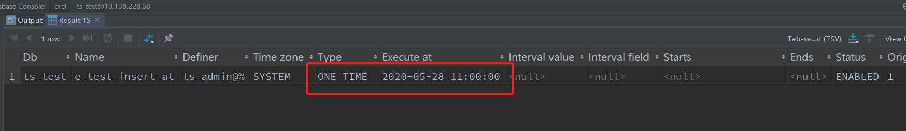
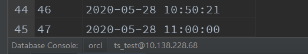
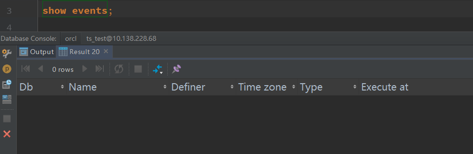
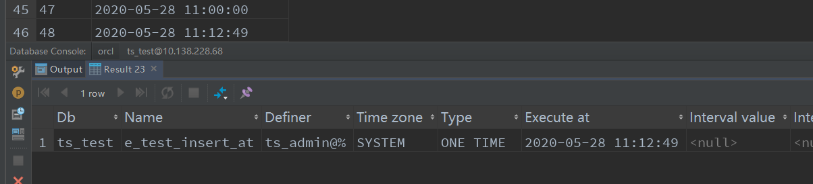
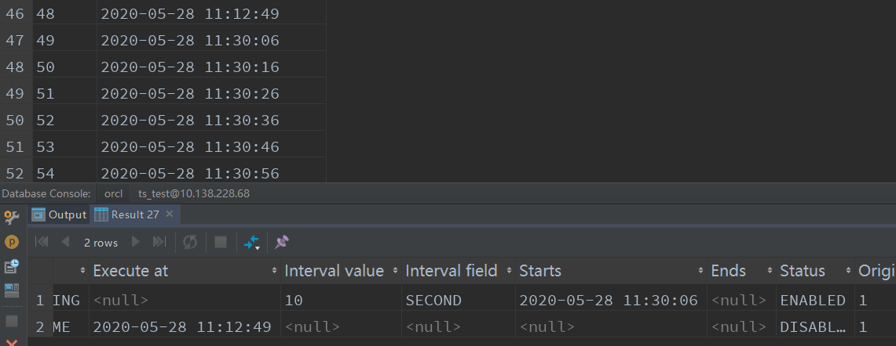
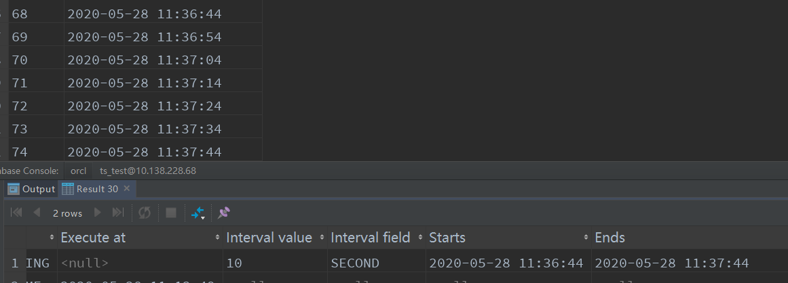

## Mysql定时事件操作

### 1.什么是事件

一组SQL集，用来执行定时任务，跟触发器很像，都是被动执行的，事件是因为时间到了触发执行，而触发器是因为某件事件（增删改）触发执行；

mqsql的事件类似于linux的定时任务，不过是完全在mqsql内部实现的。

事件是在一个独立的事件调度线程中被初始化，这个事件调度线程和处理链接的线程没有任何关系。并且该线程在事件执行结束后，会自动销毁。


### 2.开启事件

查看是否开启：

show variables like 'event_scheduler';



如果显示OFF,则输入以下语句开启：

set global event_scheduler = on;


查看事件：

通过show events;可以查看创建的事件


### 3.创建自定义事件

首先创建一张测试表。

```sql
create table test_table
(
 id int auto_increment primary key,
 create_time datetime default CURRENT_TIMESTAMP null
)
comment '用来测试的表'
;
```

#### 3.1 语法

```
CREATE EVENT [IFNOT EXISTS] event_name
  　　 ONSCHEDULE schedule
  　　 [ONCOMPLETION [NOT] PRESERVE]
  　　 [ENABLE | DISABLE]
  　　 [COMMENT ``'comment'``]
  　　 DO sql_statement;
```

##### 解释：

event_name： 自己取的事件名

schedule：触发的时间周期。写法为：

```
AT TIMESTAMP [+ INTERVAL INTERVAL]
或 EVERY INTERVAL [STARTS TIMESTAMP] [ENDS TIMESTAMP]
```

AT + 时间戳，用来完成单次的计划任务

EVERY 时间（单位）的数量实践单位[STARTS 时间戳] [ENDS时间戳]，用来完成重复的计划任务。

其中 INTERVAL 的取值又有每年/每月等等：

```
{YEAR | QUARTER | MONTH | DAY | HOUR | MINUTE |
　　 WEEK | SECOND | YEAR_MONTH | DAY_HOUR | DAY_MINUTE |
　　 DAY_SECOND | HOUR_MINUTE | HOUR_SECOND | MINUTE_SECOND}
```

很多，但是常用的YEAR，MONTH，DAY，HOUR，MINUTE 或者SECOND。剩下的不标准的不建议使用。

ON COMPLETION参数

表示"当这个事件不会再发生的时候"，即当单次计划任务执行完毕后或当重复性的计划任务执行到了ENDS阶段。而PRESERVE的作用是使事件在执行完毕后阻止该事件被Drop掉。所以，对于特定时间执行的事件，如果保持默认，执行完毕后，事件将被删除，不想删除的话要设置成ON COMPLETION PRESERVE。对于重复性时间，如果设置了ON COMPLETION NOT PRESERVE，那么也是只会在执行一次后停止并删除事件。

[ENABLE | DISABLE] 可以设置该事件创建后状态是否开启或关闭，默认为ENABLE。

[COMMENT ‘comment’]可以给该事件加上注释。

#### 3.2 例子

##### 3.2.1 每隔10秒插入一条记录

```
CREATE EVENT e_test_insert
ON SCHEDULE EVERY 10 SECOND
DO insert INTO test_table (create_time) VALUES (current_timestamp)
```

可以通过show events;查看刚创建的事件



查看test_table




##### 3.2.2 在特定时间执行一次

```
CREATE EVENT e_test_insert_at
ON SCHEDULE AT TIMESTAMP '2020-05-28 11:00:00'
DO insert INTO test_table (create_time) VALUES (current_timestamp)
```



到时间后，查看test_table



确实执行了。再查看一下事件



被删除了。验证了前面的ON COMPLETION参数

##### 3.2.3 在指定延时后执行一次

```
CREATE EVENT e_test_insert_at
ON SCHEDULE AT CURRENT_TIMESTAMP+INTERVAL 50 SECOND
ONCOMPLETION PRESERVE
DO insert INTO test_table (create_time) VALUES (current_timestamp)
```

50秒后执行一次，并且不要完成后不要删除任务。



并且执行完成后，没有被删除


##### 3.2.4  5分钟后开始，每10秒插入一次

```
CREATE EVENT e_test_insert
ON SCHEDULE EVERY 10 SECOND
STARTS CURRENT_TIMESTAMP+INTERVAL 5 MINUTE
DO insert INTO test_table (create_time) VALUES (current_timestamp)
```

Starts关键字，可以指定在什么时候开始




##### 3.2.5 指定时间后结束

```
CREATE EVENT e_test_insert
  ON SCHEDULE EVERY 10 SECOND
  STARTS CURRENT_TIMESTAMP+INTERVAL 1 MINUTE
  ENDS CURRENT_TIMESTAMP+INTERVAL 2 MINUTE
DO insert INTO test_table (create_time) VALUES (current_timestamp);
```

在当前1分钟后开始，在当前2分钟后结束。所以，只会执行1分钟。



##### 3.2.6 每天的定时执行

```
CREATE EVENT e_test_insert_day
  ON SCHEDULE EVERY 1 DAY
  STARTS DATE_ADD(DATE_ADD(CURDATE(), INTERVAL 1 DAY), INTERVAL 1 HOUR)
DO insert INTO test_table (create_time) VALUES (current_timestamp);
```

每天1点执行一次。DATE_ADD是mysql得内置函数，对某个时间加上指定时间。

##### 3.2.7 每个月的29号0点30分执行一次

```
CREATE EVENT e_test_insert_month
  ON SCHEDULE EVERY 1 MONTH
  STARTS DATE_ADD(DATE_ADD('2020-04-29', INTERVAL 1 MONTH), INTERVAL 30 MINUTE)
DO insert INTO test_table (create_time) VALUES (current_timestamp);
```


##### 3.2.8 每小时的30分时执行一次

```
CREATE EVENT e_test_insert_hour
  ON SCHEDULE EVERY 1 HOUR
  STARTS DATE_ADD('2020-05-28 13:30:00', INTERVAL 1 HOUR)
DO insert INTO test_table (create_time) VALUES (current_timestamp);
```


### 4，删除事件

语法：

```
DROP EVENT [IF EXISTS] event_name
```

如果事件不存在，会报错。所以执行时，最好加上IF EXISTS


### 5， 修改事件

语法：

```
ALTER EVENT event_name 
[ON SCHEDULE schedule] 
[RENAME TO new_event_name]
[ON COMPLETION [NOT] PRESERVE]
[COMMENT ``'comment'``]
[ENABLE | DISABLE]
[DO sql_statement]
```

##### 5.1  临时关闭事件

```
ALTER EVENT e_test DISABLE;
```

##### 5.2  开启事件

```
ALTER EVENT e_test ENABLE;
```

##### 5.3 将每天清空test表改为5天清空一次：

```
ALTER EVENT e_test ON SCHEDULE EVERY 5 DAY;
```

