作者：陈维贤
链接：https://zhuanlan.zhihu.com/p/146958975
来源：知乎
著作权归作者所有。商业转载请联系作者获得授权，非商业转载请注明出处。

# ***01*****竞业协议到底是啥？**

 进大厂难，出大厂更难，想在大厂之间 “反复横跳” 更是难上加难！
脉脉上就有不少大厂员工爆料，称受竞业协议限制，离职后**几乎不能到任何知名企业工作。**  所以，这个坑爹的竞业协议究竟是什么鬼？进大厂非得签这个竞业协议么？ 

## **1）竞业协议到底是啥？**

 所谓竞业协议，又称 “竞业禁止协议”，指公司为了保护自己的商业利益，禁止员工在离职后前往竞品公司就职的一项制度。 说人话就是 —— **离职后不许到「原公司规定的对家」工作。** 当然，老东家每个月还会给你点补偿金，不太多，基本就原薪资的 30%，只保证你不被饿死。 但是，你如果拿了老东家的钱，还要跳槽到对家去，那老东家就有权把你告上法庭，让你 N 倍赔偿补偿金。     

前百度员工因违反竞业协议被判赔偿83万 和普通协议不同，竞业协议并不是签了就立马生效的，而是分「签署」和「启动」两个阶段。 

### **① 签署**

 虽然说，签署竞业协议**号称是“自愿”**的，但是，员工真的有选择的权利吗？ 很多公司会在涉及到你关键利益的节点，让你签竞业协议。比如入职前、获得公司期权前，甚至是开离职证明前…… 如果不签，利益受损是很难避免的。 有的网易员工就在脉脉上爆料，必须签一份很苛刻的竞业协议，才能拿股票期权： 

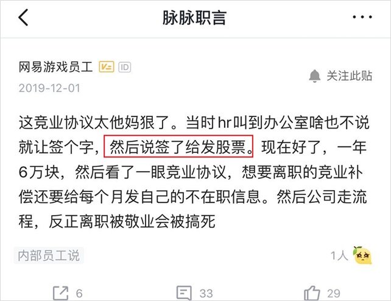

### **② 启动**

 虽然是自己“自愿”签的，但是离职后，是否启动这份竞业协议，就由不得员工了——**主动权掌握在公司手里。** 只要公司选择启动协议并开始发放补偿金，不管你同不同意，都视为协议生效。 腾讯员工就表示自己离职时被启动竞业，措手不及： 

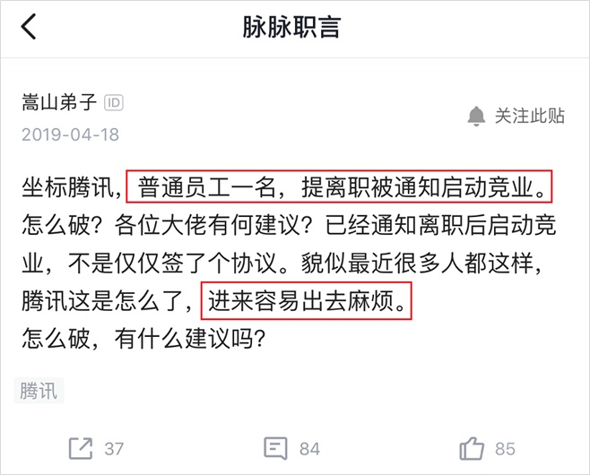

 之前还有某厂员工，在竞业协议的落款处写了大大的“不”字，但是还是被强行启动了竞业协议，最后被法院判了违反竞业协议，要赔公司天文数字…… 其实，这条法例本来是国家为了**防止公司之间的恶性竞争**制定的。
一般来说，只有涉及到公司核心商业机密的职位，才会签署这项竞业协议。 但是，为了做好 “人才截留” ，让**对家也得不到自己流失的人才**，很多大厂已经迈出了全员签署竞业协议的步伐，连实习生也不放过： 

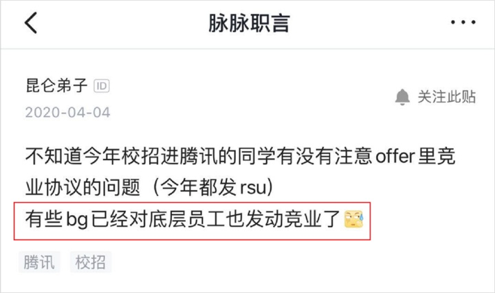

 这……这简直就是得不到就要毁掉的最佳诠释吧。 

## **2）竞业调查有多狠？**

 互联网大厂们针开展竞业调查的手段有多狠，我们根本想象不到： 比如，前公司会给竞品公司邮寄空快递，如果员工签收了，就算坐实了违反竞业协议，马上安排告上法庭： 

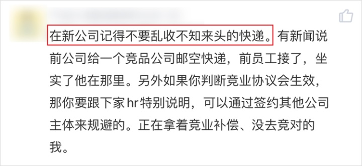

刚跳槽就不要随便 “剁手” 了 你以为钓鱼包裹是大厂 “追杀” 前员工的最狠的手段吗？ no no no ，必要时候他们还会**派出私家侦探盯住**你…… 关于竞业，有一个很出名的案例： 字节跳动曾经派出过私家侦探，蹲守某跳槽腾讯的应届生员工，还把他刷卡进出大楼的照片作为起诉他的证据之一： 

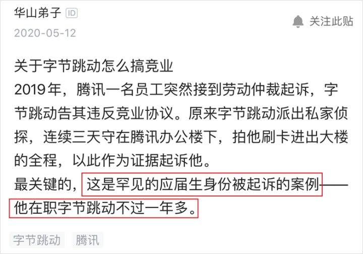

 除此之外，签收记录、电话录音等，一切可以证明你在竞品公司工作的资料，都可以被当作证据，提交给法庭。 据《财经》调查，互联网大厂进行竞业禁止调查的手段，主要有以下5种：

> 寄快递或假装快递员，向竞品公司给前员工**寄送包裹**，在前员工签收时录下全程视频；
>
> 调取前员工的**社保记录**；
>
> 询问竞品公司的前台等员工，或直接**打匿名电话**向本人证实。“请问你是/这里有xxx (title) 吗？”，如果得到确定回答，这份录音会成为呈堂证供；
>
> 请**私家侦探**跟拍；
>
> **媒体报道、朋友圈、甚至是微信聊天记录**等一切相关消息渠道。 

看到这里，你可能会产生疑问，这些通过「非常规手段」取得的证据，真的具有法律效用么？ 查了多个庭审案例后，我发现，其实最后**起决定性作用****的还是一些****严肃证据**，比如 “社保记录”、“个税代缴记录” 等。     

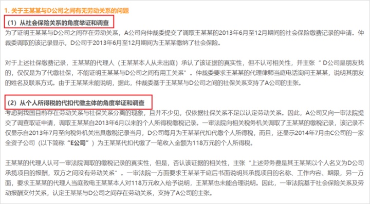

 所以说，像私家侦探、录音视频这种辅助手段，**可以作为证据提交，但作用不大。**
这些证据，主要还是为了攻破离职员工的心理防线，迫使员工主动从竞品公司离职。

# ***02*****丢工作、少赚钱，**竞业协议有多坑？

 可能有人会问，竞业协议听着挺好的，还给补偿金，上一份班拿两份钱，它不香吗？ 当然不香！ 对大部分职场人来说，“被竞业”简直就是大难临头，你的会被迫“中断”职业生涯、钱不够花，甚至是被骚扰…… 

### **① 钱不够花**

 别看人家调查竞业的时候不惜一切人力物力代价，对于真正乖乖遵守协议的人，他们倒是开始“一毛不拔”。 **首先，**竞业协议规定，发放的**补偿金**不得低于原工资的 30% 。话虽如此，很多公司都把这条协议默认为**“只支付 30%”。** 在一线城市，这点钱还不够还房贷的呢…… 比如某网易员工，被原领导穿小鞋挤走了不说，还被骗签了一个十分苛刻的竞业协议，拿到的补偿金连房贷还不上，只能发文怒斥“网易给我上了人生中最重要的一课”： 

 这位兄弟的遭遇有多惨我不多赘述了，看这惊人的“在看”数，也能感受到大家对他有多同情…… **其次，**很多岗位的工资，都是以“低底薪+高提成”的模式支付的，比如 BD 、销售。一旦遭遇竞业，原公司**只需要支付底薪的 30%** 就可以了。 举个例子，某些平台的 BD 岗位，底薪 5000 、提成 7000 ，一旦被竞业，每个月就只能拿到 1500 的竞业补偿……就这么点钱就能把你圈住，公司何乐而不为呢？ 另外，还有一些公司会“无意”把员工的税算错，也是为了减少竞业补偿的发放。 **最后，**我国法律规定，企业连续 3 个月不支付补偿金，才算是竞业协议失效。因此，很多公司选择**在竞业协议还有 3 个月到期时，直接停止支付补偿金。** 竞业协议依然生效，还不用给钱……这一招空手套白狼，真是绝妙。 

### **② 职业生涯中断**

 现在的互联网大厂的业务涉及都很广，因此厂之间大多有业务重叠。 也就是说，离开了一家大厂后，可能你就很难再在其他大厂入职了，比如百度的竞业对象： 

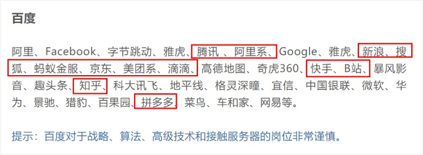

 请问员工离开百度是要直接饿死公司才满意吗
一般来说，非核心人员的竞业协议有效期是一年，核心人员、高管等有效期会长达两年。 在瞬息万变的互联网时代，两年足以让很多事情做出翻天覆地的改变了。 很多背着竞业协议的人才，为了养家糊口，不得不去**降薪**去一些很不起眼的小公司就职。 两年时间过去，不仅身价降了，视野也窄了不少，**整个职业生涯都会受到影响。**

### **③ 被骚扰**

 前不久，一条脉脉职言的帖子在网上流传，称自己怀孕离职后持续遭到字节跳动的骚扰，不仅少算竞业补偿、寄钓鱼包裹，联系包裹发件人还要遭到辱骂…… 

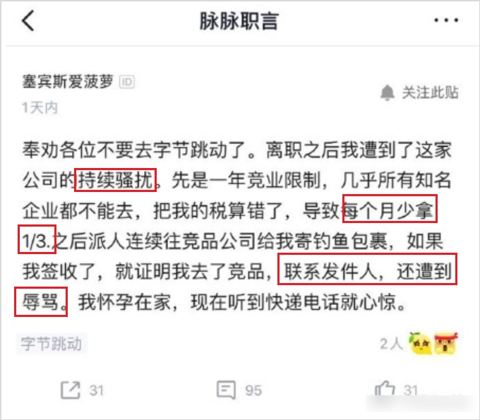

 另外一位实名 diss 今日头条的勇士，也有一份“被竞业”的惨痛经历： 

> 离职时拒签竞业，直接被今日头条起诉，要求赔公司 150w ；
>
> 
>
> 仲裁驳回了还不罢休，继续向法院上诉。

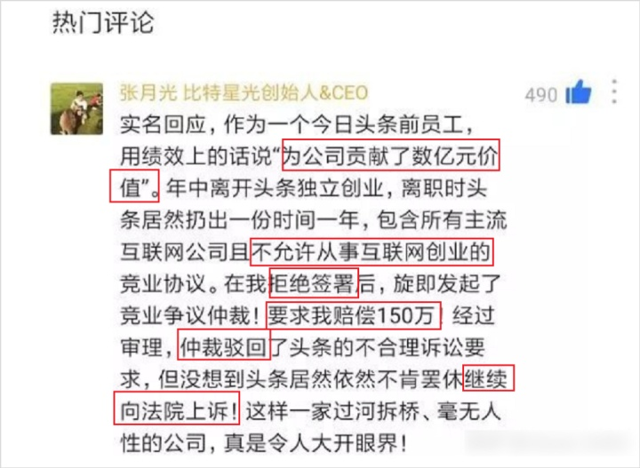

 不过，这两条帖子目前已经看不到了，不知是被公关了，还是因为真实性存疑。 虽说竞业如此严格，但**万事总有例外。** 前几天，前魅族高管杨柘刚刚因为“想照顾家庭”离职，就火速出任小米中国区 CMO ，仿佛竞业协议是一场梦，醒了只剩很感动：    

小米新任 CMO 杨柘，曾就职过三星、华为、魅族等著名手机厂商 这就很迷，杨柘不是要多照顾家庭吗，为啥还去小米上班？还光明正大的发微博显摆？ 这么快乐，雷总是不是给他在公司旁边买房、发媳妇了…… 

 难道说，真正的大佬们，都不 care 竞业协议？ 当然不是！ 管理者们接触的核心机密更多，当然也背负着更严苛的竞业协议。
对于大佬来说，我们这些普通人最怕的赔钱加从竞品公司辞职走人，都是竞业调查“最好的”结果。 一招不慎，你可能**身败名裂，甚至锒铛入狱**…… 比如，今年年初，前联想副总裁常程宣布跳槽小米，负责小米手机产品线。 在此之前，常程已在联想工作近二十年，联想表示保留起诉权利：     

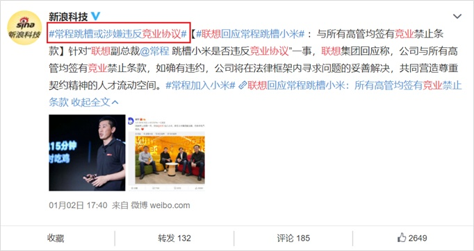

 当然，联想还是比较仁慈，只是预备起诉；**腾讯**就比较狠了，贡献了国内最早、最轰动的案例： 2013 年，时任腾讯电子商务部总经理的刘春宁，宣布自己要离职创业后，转身却拿着腾讯的股票加入了阿里巴巴，当月就被任命为阿里数字事业群总裁。 刘春宁出走 2 年后，遭到腾讯的“内部举报、审计”，称其“在职期间有贪腐问题”，被深圳警方带走。
不仅阿里总裁做不成，还直接成了**阶下囚**：    

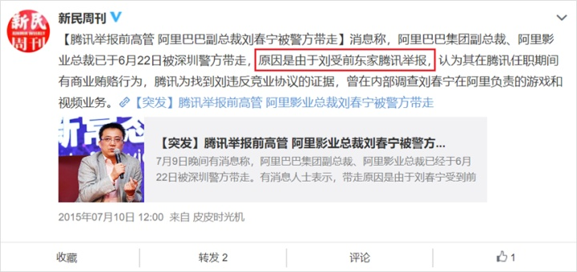

 要说腾讯还是 6 ，你走再久，我也能想办法把你拉下水。 还有以“狼性”著称的**华为**，先是把 6 个中高层以“泄密”为由**全抓了**。 酷派 CEO 当时还直接跳出来背锅，表示这些人中有入职酷派的，就差把“我能抢过华为”写脸上了：     

# ***03*****结语**

 如果你要问，“竞业协议” 真有这么重要吗？当然！ 随着**互联网巨头业务的互相交错，人才竞争也越来越激烈。**因此，各个巨头之间的抢人大战，说是“腥风血雨”也不为过。 董明珠曾经公开吐槽过奥克斯“天天挖人”，还帮助跳槽员工制造新身份，躲避格力的竞业调查：     

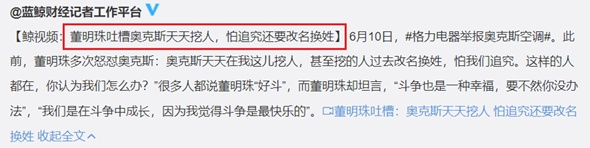

 百度更惨，北京互联网中层以上，一半都是百度人：     

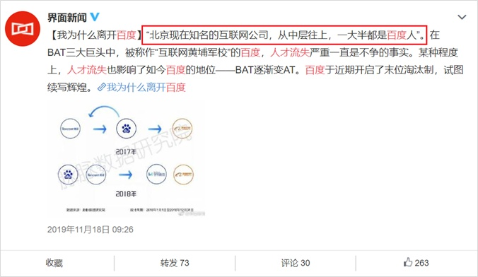

 话虽如此，但是“全员竞业”的确没有必要。 不得不承认，现在很多互联网大厂都**把竞业协议当做打压对家的手段。**
不仅公司为此付出了高额的金钱代价，许多无辜的员工也被迫“陪跑”，损失更是无法估量。 时代的一粒灰，落到个人身上就是一座山。**
****没有一个个体，应当为公司之间的商业竞争买单。**